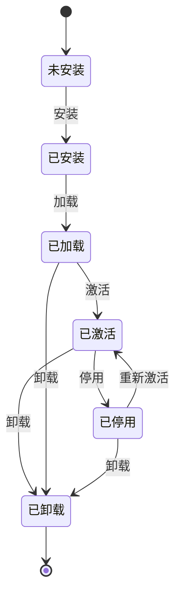

# Tauri AI 聊天应用插件系统总体架构设计

## 执行摘要

基于对 Tauri 2.x 架构和 VSCode 插件系统的深度研究，本文档设计了一套适用于 AI 聊天应用的插件系统总体架构。该架构采用技术栈中立设计，基于 Tauri 的 Commands/Events/Channels 通信机制，提供完整的插件生命周期管理、性能优化策略和核心功能支持。

核心设计原则：
- **技术栈中立**：支持 React、Vue、Svelte 等多种前端框架
- **基于 Tauri IPC**：充分利用 Commands/Events/Channels 通信机制
- **生命周期管理**：完整的插件安装、加载、激活、停用、卸载流程
- **性能优化**：懒加载、内存管理、热更新机制
- **功能支持**：文件处理、网络请求、本地存储等核心能力

---

## 1. 总体架构设计

### 1.1 架构分层

```
┌─────────────────────────────────────────────────────────┐
│                    前端层 (Frontend Layer)                    │
├─────────────────┬─────────────────┬─────────────────┤
│   React/Vue     │   Svelte/其他   │   通用组件库     │
│   AI聊天界面     │   前端框架      │   UI组件        │
└─────────────────┴─────────────────┴─────────────────┘
                            │
                            ▼ IPC 通信桥接
┌─────────────────────────────────────────────────────────┐
│                   插件桥接层 (Plugin Bridge)                 │
├─────────────────┬─────────────────┬─────────────────┤
│   插件管理器     │   通信协调器     │   生命周期管理   │
│   PluginManager │   IPC Coordinator│   LifecycleMgr  │
└─────────────────┴─────────────────┴─────────────────┘
                            │
                            ▼
┌─────────────────────────────────────────────────────────┐
│                   核心插件层 (Core Plugin Layer)            │
├─────────────────┬─────────────────┬─────────────────┤
│   文件处理插件   │   网络请求插件   │   本地存储插件   │
│   File Plugin   │   Network Plugin│   Storage Plugin│
└─────────────────┴─────────────────┴─────────────────┘
                            │
                            ▼ Tauri Commands/Events/Channels
┌─────────────────────────────────────────────────────────┐
│                   Tauri 后端层 (Tauri Backend)             │
├─────────────────┬─────────────────┬─────────────────┤
│   Rust核心逻辑   │   系统API接口    │   权限管理      │
│   Core Logic    │   System APIs   │   Permissions   │
└─────────────────┴─────────────────┴─────────────────┘
```

### 1.2 核心组件设计

#### 1.2.1 插件管理器 (PluginManager)
- **职责**：插件的注册、发现、加载、卸载
- **特性**：支持动态加载、依赖管理、版本控制
- **位置**：前端层与插件桥接层之间

#### 1.2.2 通信协调器 (IPC Coordinator)
- **职责**：统一管理 Commands/Events/Channels 通信
- **特性**：类型安全、错误处理、流式数据支持
- **位置**：插件桥接层

#### 1.2.3 生命周期管理器 (LifecycleManager)
- **职责**：插件生命周期状态管理
- **状态**：安装 → 加载 → 激活 → 运行 → 停用 → 卸载
- **位置**：插件桥接层

#### 1.2.4 权限管理器 (PermissionManager)
- **职责**：插件权限控制和安全隔离
- **特性**：最小权限原则、运行时权限检查
- **位置**：Tauri 后端层

---

## 2. 通信机制设计

### 2.1 IPC 原语选择

基于 Tauri 的三种 IPC 原语，设计插件通信机制：

| 通信类型 | 用途 | 插件场景 | 优势 |
|---------|------|----------|------|
| Commands | 同步/异步函数调用 | 插件初始化、配置操作 | 类型安全、错误处理 |
| Events | 事件推送 | 状态通知、进度更新 | 简单、广播支持 |
| Channels | 持久双向通道 | 流式AI响应、实时数据 | 适合长连接场景 |

### 2.2 插件通信架构

```typescript
// 插件通信接口设计
interface PluginIPC {
  // Commands - 插件命令调用
  invoke<T>(command: string, args?: any): Promise<T>;
  
  // Events - 事件监听
  on<T>(event: string, handler: (data: T) => void): () => void;
  emit<T>(event: string, data: T): void;
  
  // Channels - 双向通道
  createChannel<T>(id: string): PluginChannel<T>;
}

// 插件通道接口
interface PluginChannel<T> {
  send(data: T): void;
  onMessage(handler: (data: T) => void): void;
  close(): void;
}
```

### 2.3 消息协议设计

```typescript
// 插件消息协议
interface PluginMessage {
  id: string;
  type: 'command' | 'event' | 'channel';
  pluginId: string;
  method: string;
  payload: any;
  timestamp: number;
  responseTo?: string; // 关联的请求ID
}

// 插件响应协议
interface PluginResponse {
  id: string;
  success: boolean;
  data?: any;
  error?: {
    code: string;
    message: string;
    details?: any;
  };
  timestamp: number;
}
```

---

## 3. 插件生命周期管理

### 3.1 生命周期状态机



### 3.2 生命周期阶段详解

#### 3.2.1 安装阶段 (Install)
- **操作**：下载插件包、验证签名、解压文件
- **文件结构**：
  ```
  plugins/
  ├── plugin-id/
  │   ├── manifest.json          # 插件清单
  │   ├── frontend/              # 前端代码
  │   │   ├── index.js
  │   │   └── assets/
  │   ├── backend/               # 后端代码（Rust）
  │   │   ├── src/
  │   │   └── Cargo.toml
  │   ├── permissions.json       # 权限配置
  │   └── README.md
  ```

#### 3.2.2 加载阶段 (Load)
- **操作**：读取清单、验证权限、初始化前端组件
- **检查项**：
  - 插件清单完整性
  - 权限声明合理性
  - 依赖版本兼容性
  - 安全签名验证

#### 3.2.3 激活阶段 (Activate)
- **操作**：执行激活逻辑、注册事件监听、建立通信通道
- **触发条件**：
  - 用户主动激活
  - 满足激活事件条件
  - 系统自动激活（配置允许）

#### 3.2.4 运行阶段 (Active)
- **操作**：响应用户操作、处理数据、执行插件功能
- **资源管理**：
  - 内存使用监控
  - CPU占用限制
  - 网络请求配额

#### 3.2.5 停用阶段 (Deactivate)
- **操作**：清理资源、取消事件监听、关闭通道
- **清理项**：
  - 定时器清理
  - 事件监听器移除
  - 内存缓存释放
  - 网络连接关闭

#### 3.2.6 卸载阶段 (Uninstall)
- **操作**：删除文件、清理配置、移除权限
- **安全考虑**：
  - 数据备份提醒
  - 彻底清理验证
  - 权限撤销确认

### 3.3 生命周期管理实现

```typescript
// 生命周期管理器
class LifecycleManager {
  private plugins: Map<string, PluginInstance> = new Map();
  private stateListeners: Map<string, Set<LifecycleListener>> = new Map();

  // 安装插件
  async install(pluginPackage: PluginPackage): Promise<void> {
    // 1. 验证插件包
    await this.validatePlugin(pluginPackage);
    
    // 2. 解压到插件目录
    await this.extractPlugin(pluginPackage);
    
    // 3. 注册插件
    await this.registerPlugin(pluginPackage.manifest);
    
    // 4. 触发安装后事件
    this.emit('plugin:installed', pluginPackage.manifest.id);
  }

  // 加载插件
  async load(pluginId: string): Promise<void> {
    const plugin = this.plugins.get(pluginId);
    if (!plugin) throw new Error(`Plugin ${pluginId} not found`);

    try {
      // 1. 读取插件清单
      const manifest = await this.loadManifest(pluginId);
      
      // 2. 验证权限
      await this.validatePermissions(manifest);
      
      // 3. 加载前端组件
      await this.loadFrontend(pluginId);
      
      // 4. 初始化后端
      await this.initializeBackend(pluginId);
      
      plugin.state = 'loaded';
      this.emit('plugin:loaded', pluginId);
    } catch (error) {
      plugin.state = 'error';
      throw error;
    }
  }

  // 激活插件
  async activate(pluginId: string): Promise<void> {
    const plugin = this.plugins.get(pluginId);
    if (!plugin || plugin.state !== 'loaded') {
      throw new Error(`Plugin ${pluginId} not ready for activation`);
    }

    try {
      // 1. 执行激活逻辑
      await plugin.frontend.activate();
      
      // 2. 注册事件监听
      await this.registerEventListeners(pluginId);
      
      // 3. 建立通信通道
      await this.setupCommunication(pluginId);
      
      plugin.state = 'active';
      this.emit('plugin:activated', pluginId);
    } catch (error) {
      plugin.state = 'error';
      throw error;
    }
  }

  // 停用插件
  async deactivate(pluginId: string): Promise<void> {
    const plugin = this.plugins.get(pluginId);
    if (!plugin || plugin.state !== 'active') {
      return;
    }

    try {
      // 1. 清理资源
      await plugin.frontend.deactivate();
      
      // 2. 移除事件监听
      await this.removeEventListeners(pluginId);
      
      // 3. 关闭通信通道
      await this.closeCommunication(pluginId);
      
      plugin.state = 'deactivated';
      this.emit('plugin:deactivated', pluginId);
    } catch (error) {
      console.error(`Failed to deactivate plugin ${pluginId}:`, error);
    }
  }

  // 卸载插件
  async uninstall(pluginId: string): Promise<void> {
    // 1. 停用插件（如果正在运行）
    if (this.plugins.get(pluginId)?.state === 'active') {
      await this.deactivate(pluginId);
    }

    // 2. 从注册表移除
    this.plugins.delete(pluginId);

    // 3. 删除文件
    await this.removePluginFiles(pluginId);

    // 4. 清理权限
    await this.cleanupPermissions(pluginId);

    this.emit('plugin:uninstalled', pluginId);
  }
}
```

---

## 4. 性能优化策略

### 4.1 懒加载机制

#### 4.1.1 插件懒加载
```typescript
// 插件懒加载实现
class PluginLazyLoader {
  private loadedPlugins: Set<string> = new Set();
  private loadingPromises: Map<string, Promise<any>> = new Map();

  // 按需加载插件
  async loadPluginOnDemand(pluginId: string): Promise<PluginInstance> {
    // 如果已加载，直接返回
    if (this.loadedPlugins.has(pluginId)) {
      return this.getPluginInstance(pluginId);
    }

    // 如果正在加载，等待加载完成
    if (this.loadingPromises.has(pluginId)) {
      return this.loadingPromises.get(pluginId);
    }

    // 开始加载
    const loadPromise = this.performLoad(pluginId);
    this.loadingPromises.set(pluginId, loadPromise);

    try {
      const plugin = await loadPromise;
      this.loadedPlugins.add(pluginId);
      this.loadingPromises.delete(pluginId);
      return plugin;
    } catch (error) {
      this.loadingPromises.delete(pluginId);
      throw error;
    }
  }

  // 预加载相关插件
  preloadRelatedPlugins(basePluginId: string): void {
    const plugin = this.getPluginManifest(basePluginId);
    if (plugin.dependencies) {
      plugin.dependencies.forEach(depId => {
        if (!this.loadedPlugins.has(depId)) {
          this.loadPluginOnDemand(depId).catch(console.error);
        }
      });
    }
  }
}
```

#### 4.1.2 组件懒加载
```typescript
// 前端组件懒加载
const LazyPluginComponent = React.lazy(() => 
  import('./PluginComponent').then(module => ({
    default: module.PluginComponent
  }))
);

// 插件视图懒加载
class PluginViewManager {
  private viewCache: Map<string, React.ComponentType> = new Map();

  async loadPluginView(pluginId: string): Promise<React.ComponentType> {
    if (this.viewCache.has(pluginId)) {
      return this.viewCache.get(pluginId)!;
    }

    const pluginModule = await import(`./plugins/${pluginId}/view`);
    const ViewComponent = pluginModule.default;
    
    this.viewCache.set(pluginId, ViewComponent);
    return ViewComponent;
  }

  // 卸载视图时清理缓存
  unloadPluginView(pluginId: string): void {
    this.viewCache.delete(pluginId);
  }
}
```

### 4.2 内存管理

#### 4.2.1 内存监控
```typescript
// 内存监控管理器
class MemoryManager {
  private memoryThresholds = {
    warning: 100 * 1024 * 1024, // 100MB
    critical: 200 * 1024 * 1024  // 200MB
  };

  private pluginMemoryUsage: Map<string, number> = new Map();

  // 监控插件内存使用
  monitorPluginMemory(): void {
    setInterval(() => {
      const usage = this.getMemoryUsage();
      this.checkThresholds(usage);
    }, 5000); // 每5秒检查一次
  }

  // 获取插件内存使用
  getPluginMemoryUsage(pluginId: string): number {
    // 实现具体的内存使用统计逻辑
    return performance.memory?.usedJSHeapSize || 0;
  }

  // 内存压力处理
  handleMemoryPressure(): void {
    // 1. 清理未使用的插件缓存
    this.cleanupUnusedCaches();
    
    // 2. 停用低优先级插件
    this.deactivateLowPriorityPlugins();
    
    // 3. 触发垃圾回收提示
    if (window.gc) {
      window.gc();
    }
  }
}
```

#### 4.2.2 资源清理
```typescript
// 资源清理管理器
class ResourceCleanupManager {
  private cleanupTasks: Map<string, Array<() => void>> = new Map();

  // 注册清理任务
  registerCleanup(pluginId: string, cleanupFn: () => void): void {
    if (!this.cleanupTasks.has(pluginId)) {
      this.cleanupTasks.set(pluginId, []);
    }
    this.cleanupTasks.get(pluginId)!.push(cleanupFn);
  }

  // 执行清理任务
  async performCleanup(pluginId: string): Promise<void> {
    const tasks = this.cleanupTasks.get(pluginId) || [];
    
    for (const task of tasks) {
      try {
        await task();
      } catch (error) {
        console.error(`Cleanup task failed for plugin ${pluginId}:`, error);
      }
    }
    
    this.cleanupTasks.delete(pluginId);
  }

  // 自动清理过期资源
  autoCleanupExpiredResources(): void {
    setInterval(() => {
      // 清理过期的定时器
      this.cleanupExpiredTimers();
      
      // 清理未使用的事件监听器
      this.cleanupUnusedEventListeners();
      
      // 清理已关闭的网络连接
      this.cleanupClosedConnections();
    }, 60000); // 每分钟执行一次
  }
}
```

### 4.3 热更新机制

#### 4.3.1 插件热更新
```typescript
// 热更新管理器
class HotUpdateManager {
  private updateListeners: Map<string, Set<UpdateListener>> = new Map();

  // 监听插件更新
  watchPluginUpdates(pluginId: string): void {
    // 1. 监听文件系统变化
    this.watchFileChanges(pluginId);
    
    // 2. 监听网络更新检查
    this.scheduleUpdateCheck(pluginId);
  }

  // 执行热更新
  async performHotUpdate(pluginId: string, newVersion: string): Promise<void> {
    const currentPlugin = this.getPluginInstance(pluginId);
    
    try {
      // 1. 备份当前状态
      const backup = await this.backupPluginState(pluginId);
      
      // 2. 停用插件
      await this.deactivatePlugin(pluginId);
      
      // 3. 下载新版本
      await this.downloadNewVersion(pluginId, newVersion);
      
      // 4. 加载新版本
      await this.loadPlugin(pluginId);
      
      // 5. 恢复状态
      await this.restorePluginState(pluginId, backup);
      
      // 6. 重新激活
      await this.activatePlugin(pluginId);
      
      this.emit('plugin:hotUpdated', pluginId, newVersion);
    } catch (error) {
      // 回滚到原版本
      await this.rollbackPlugin(pluginId, backup);
      throw error;
    }
  }

  // 增量更新
  async performIncrementalUpdate(pluginId: string, changes: PluginChanges): Promise<void> {
    // 1. 应用代码变更
    await this.applyCodeChanges(pluginId, changes.code);
    
    // 2. 更新清单文件
    await this.updateManifest(pluginId, changes.manifest);
    
    // 3. 重新加载模块
    await this.reloadPluginModules(pluginId);
    
    // 4. 触发更新事件
    this.emit('plugin:incrementalUpdated', pluginId, changes);
  }
}
```

#### 4.3.2 代码分割与动态加载
```typescript
// 代码分割管理器
class CodeSplitManager {
  private moduleCache: Map<string, any> = new Map();
  private loadingPromises: Map<string, Promise<any>> = new Map();

  // 动态导入插件模块
  async importPluginModule(modulePath: string): Promise<any> {
    if (this.moduleCache.has(modulePath)) {
      return this.moduleCache.get(modulePath);
    }

    if (this.loadingPromises.has(modulePath)) {
      return this.loadingPromises.get(modulePath);
    }

    const importPromise = import(modulePath);
    this.loadingPromises.set(modulePath, importPromise);

    try {
      const module = await importPromise;
      this.moduleCache.set(modulePath, module);
      this.loadingPromises.delete(modulePath);
      return module;
    } catch (error) {
      this.loadingPromises.delete(modulePath);
      throw error;
    }
  }

  // 预加载关键模块
  preloadCriticalModules(): void {
    const criticalModules = [
      './plugins/ai-chat/core',
      './plugins/file-manager/core',
      './plugins/settings/core'
    ];

    criticalModules.forEach(module => {
      this.importPluginModule(module).catch(console.error);
    });
  }
}
```

---

## 5. 核心功能支持

### 5.1 文件处理功能

#### 5.1.1 文件系统访问接口
```typescript
// 文件处理插件接口
interface FilePluginAPI {
  // 文件读写
  readFile(path: string, encoding?: string): Promise<string | ArrayBuffer>;
  writeFile(path: string, data: string | ArrayBuffer): Promise<void>;
  
  // 目录操作
  readDir(path: string): Promise<FileInfo[]>;
  createDir(path: string): Promise<void>;
  removeDir(path: string): Promise<void>;
  
  // 文件监控
  watch(path: string, callback: (event: FileEvent) => void): () => void;
  
  // 权限检查
  checkPermission(path: string, operation: FileOperation): Promise<boolean>;
}

// 文件信息接口
interface FileInfo {
  name: string;
  path: string;
  isDirectory: boolean;
  size: number;
  modified: Date;
  permissions: string;
}
```

#### 5.1.2 文件处理插件实现
```rust
// Tauri 后端文件处理命令
use tauri::{command, AppHandle, State};
use std::fs;
use std::path::Path;

#[command]
pub async fn read_file_content(
    app: AppHandle,
    file_path: String,
    encoding: Option<String>
) -> Result<String, String> {
    let path = Path::new(&file_path);
    
    // 权限检查
    if !has_file_permission(&app, path, "read")? {
        return Err("权限不足".to_string());
    }
    
    // 读取文件
    match fs::read_to_string(path) {
        Ok(content) => Ok(content),
        Err(e) => Err(format!("读取文件失败: {}", e))
    }
}

#[command]
pub async fn write_file_content(
    app: AppHandle,
    file_path: String,
    content: String
) -> Result<(), String> {
    let path = Path::new(&file_path);
    
    // 权限检查
    if !has_file_permission(&app, path, "write")? {
        return Err("权限不足".to_string());
    }
    
    // 创建目录（如果不存在）
    if let Some(parent) = path.parent() {
        fs::create_dir_all(parent)
            .map_err(|e| format!("创建目录失败: {}", e))?;
    }
    
    // 写入文件
    fs::write(path, content)
        .map_err(|e| format!("写入文件失败: {}", e))
}

#[command]
pub async fn watch_file_changes(
    app: AppHandle,
    file_path: String,
    window: tauri::Window
) -> Result<(), String> {
    let path = Path::new(&file_path).to_path_buf();
    
    // 启动文件监控任务
    tauri::async_runtime::spawn(async move {
        // 这里实现具体的文件监控逻辑
        // 可以使用 notify 或 crossbeam 等库
        println!("开始监控文件: {:?}", path);
    });
    
    Ok(())
}
```

### 5.2 网络请求功能

#### 5.2.1 网络请求接口
```typescript
// 网络请求插件接口
interface NetworkPluginAPI {
  // HTTP 请求
  get(url: string, options?: RequestOptions): Promise<Response>;
  post(url: string, data?: any, options?: RequestOptions): Promise<Response>;
  put(url: string, data?: any, options?: RequestOptions): Promise<Response>;
  delete(url: string, options?: RequestOptions): Promise<Response>;
  
  // 流式请求
  stream(url: string, options?: RequestOptions): Promise<ReadableStream>;
  
  // WebSocket 连接
  connectWebSocket(url: string, protocols?: string[]): Promise<WebSocket>;
  
  // 请求拦截器
  addRequestInterceptor(interceptor: RequestInterceptor): void;
  addResponseInterceptor(interceptor: ResponseInterceptor): void;
}

// 请求选项接口
interface RequestOptions {
  headers?: Record<string, string>;
  timeout?: number;
  retries?: number;
  retryDelay?: number;
  proxy?: string;
}
```

#### 5.2.2 网络请求插件实现
```rust
// Tauri 后端网络请求命令
use tauri::{command, AppHandle, State};
use reqwest::{Client, header};
use serde_json::Value;
use std::time::Duration;

#[command]
pub async fn make_http_request(
    app: AppHandle,
    method: String,
    url: String,
    headers: Option<Value>,
    body: Option<Value>
) -> Result<Value, String> {
    // 权限检查
    if !has_network_permission(&app, &url)? {
        return Err("网络访问权限不足".to_string());
    }
    
    let client = Client::builder()
        .timeout(Duration::from_secs(30))
        .build()
        .map_err(|e| format!("创建HTTP客户端失败: {}", e))?;
    
    let mut request = client.request(
        method.parse().unwrap_or(reqwest::Method::GET),
        &url
    );
    
    // 添加请求头
    if let Some(headers_map) = headers {
        for (key, value) in headers_map.as_object().unwrap_or(&serde_json::Map::new()) {
            if let Some(value_str) = value.as_str() {
                request = request.header(key, value_str);
            }
        }
    }
    
    // 添加请求体
    if let Some(body_json) = body {
        request = request.json(&body_json);
    }
    
    let response = request.send()
        .await
        .map_err(|e| format!("HTTP请求失败: {}", e))?;
    
    let status = response.status();
    let json_response: Value = response.json()
        .await
        .map_err(|e| format!("解析响应失败: {}", e))?;
    
    Ok(serde_json::json!({
        "status": status.as_u16(),
        "data": json_response,
        "success": status.is_success()
    }))
}

#[command]
pub async fn stream_http_request(
    app: AppHandle,
    url: String,
    window: tauri::Window
) -> Result<(), String> {
    // 权限检查
    if !has_network_permission(&app, &url)? {
        return Err("网络访问权限不足".to_string());
    }
    
    let client = Client::new();
    
    // 启动流式请求任务
    tauri::async_runtime::spawn(async move {
        let response = match client.get(&url).send().await {
            Ok(resp) => resp,
            Err(e) => {
                let _ = window.emit("network:error", 
                    serde_json::json!({"error": e.to_string()}));
                return;
            }
        };
        
        let mut stream = response.bytes_stream();
        
        while let Some(chunk) = stream.next().await {
            match chunk {
                Ok(data) => {
                    let _ = window.emit("network:chunk", 
                        serde_json::json!({"data": base64::encode(&data)}));
                }
                Err(e) => {
                    let _ = window.emit("network:error", 
                        serde_json::json!({"error": e.to_string()}));
                    break;
                }
            }
        }
        
        let _ = window.emit("network:complete", 
            serde_json::json!({"url": url}));
    });
    
    Ok(())
}
```

### 5.3 本地存储功能

#### 5.3.1 本地存储接口
```typescript
// 本地存储插件接口
interface StoragePluginAPI {
  // 键值存储
  setItem(key: string, value: any): Promise<void>;
  getItem<T>(key: string): Promise<T | null>;
  removeItem(key: string): Promise<void>;
  clear(): Promise<void>;
  
  // 批量操作
  setItems(items: Record<string, any>): Promise<void>;
  getItems(keys: string[]): Promise<Record<string, any>>;
  
  // 索引存储
  queryByIndex(indexName: string, value: any): Promise<any[]>;
  createIndex(indexName: string, keyPath: string): Promise<void>;
  
  // 事务支持
  beginTransaction(): Promise<StorageTransaction>;
  commitTransaction(transaction: StorageTransaction): Promise<void>;
  rollbackTransaction(transaction: StorageTransaction): Promise<void>;
}

// 存储事务接口
interface StorageTransaction {
  id: string;
  operations: StorageOperation[];
  timestamp: number;
}
```

#### 5.3.2 本地存储插件实现
```rust
// Tauri 后端存储命令
use tauri::{command, AppHandle, State};
use serde::{Deserialize, Serialize};
use sqlx::{Sqlite, Pool, Row};
use std::collections::HashMap;

#[derive(Debug, Serialize, Deserialize)]
pub struct StorageItem {
    pub key: String,
    pub value: String,
    pub data_type: String,
    pub created_at: chrono::DateTime<chrono::Utc>,
    pub updated_at: chrono::DateTime<chrono::Utc>,
}

#[command]
pub async fn storage_set_item(
    state: State<'_, DatabaseState>,
    key: String,
    value: serde_json::Value,
    data_type: String
) -> Result<(), String> {
    let now = chrono::Utc::now();
    
    sqlx::query!(
        r#"
        INSERT OR REPLACE INTO storage_items (key, value, data_type, created_at, updated_at)
        VALUES (?, ?, ?, ?, ?)
        "#,
        key,
        serde_json::to_string(&value).unwrap_or_default(),
        data_type,
        now,
        now
    )
    .execute(&state.pool)
    .await
    .map_err(|e| format!("存储数据失败: {}", e))?;
    
    Ok(())
}

#[command]
pub async fn storage_get_item(
    state: State<'_, DatabaseState>,
    key: String
) -> Result<Option<StorageItem>, String> {
    let row = sqlx::query!(
        "SELECT * FROM storage_items WHERE key = ?",
        key
    )
    .fetch_optional(&state.pool)
    .await
    .map_err(|e| format!("查询数据失败: {}", e))?;
    
    match row {
        Some(row) => Ok(Some(StorageItem {
            key: row.key,
            value: row.value,
            data_type: row.data_type,
            created_at: chrono::DateTime::parse_from_rfc3339(&row.created_at)
                .map_err(|e| format!("时间解析失败: {}", e))?
                .with_timezone(&chrono::Utc),
            updated_at: chrono::DateTime::parse_from_rfc3339(&row.updated_at)
                .map_err(|e| format!("时间解析失败: {}", e))?
                .with_timezone(&chrono::Utc),
        })),
        None => Ok(None)
    }
}

#[command]
pub async fn storage_query_by_index(
    state: State<'_, DatabaseState>,
    index_name: String,
    value: String
) -> Result<Vec<StorageItem>, String> {
    // 这里需要根据实际的索引结构来实现
    // 简化示例，假设索引存储在单独的表中
    
    let rows = sqlx::query!(
        r#"
        SELECT s.* FROM storage_items s
        JOIN storage_indexes i ON s.key = i.storage_key
        WHERE i.index_name = ? AND i.index_value = ?
        "#,
        index_name,
        value
    )
    .fetch_all(&state.pool)
    .await
    .map_err(|e| format!("索引查询失败: {}", e))?;
    
    let items: Vec<StorageItem> = rows.into_iter().map(|row| StorageItem {
        key: row.key,
        value: row.value,
        data_type: row.data_type,
        created_at: chrono::DateTime::parse_from_rfc3339(&row.created_at)
            .map_err(|e| format!("时间解析失败: {}", e))?
            .with_timezone(&chrono::Utc),
        updated_at: chrono::DateTime::parse_from_rfc3339(&row.updated_at)
            .map_err(|e| format!("时间解析失败: {}", e))?
            .with_timezone(&chrono::Utc),
    }).collect();
    
    Ok(items)
}
```

---

## 6. 权限与安全机制

### 6.1 权限模型设计

#### 6.1.1 权限类型
```typescript
// 权限类型定义
enum PermissionType {
  // 文件系统权限
  FILE_READ = 'file:read',
  FILE_WRITE = 'file:write',
  FILE_DELETE = 'file:delete',
  FILE_EXECUTE = 'file:execute',
  
  // 网络权限
  NETWORK_REQUEST = 'network:request',
  NETWORK_CONNECT = 'network:connect',
  
  // 存储权限
  STORAGE_READ = 'storage:read',
  STORAGE_WRITE = 'storage:write',
  STORAGE_DELETE = 'storage:delete',
  
  // 系统权限
  SYSTEM_INFO = 'system:info',
  WINDOW_CONTROL = 'window:control',
  
  // AI 权限
  AI_CHAT = 'ai:chat',
  AI_MODEL_ACCESS = 'ai:model:access'
}

// 权限配置
interface PermissionConfig {
  type: PermissionType;
  scope?: string; // 权限范围，如文件路径、域名等
  allowed?: string[]; // 允许的操作
  denied?: string[]; // 拒绝的操作
  conditions?: PermissionCondition[]; // 条件限制
}

// 权限条件
interface PermissionCondition {
  type: 'time' | 'location' | 'user' | 'device';
  operator: 'equals' | 'contains' | 'matches';
  value: any;
}
```

#### 6.1.2 权限管理器实现
```typescript
// 权限管理器
class PermissionManager {
  private permissions: Map<string, PermissionConfig[]> = new Map();
  private grantedPermissions: Map<string, Set<string>> = new Map();
  private permissionListeners: Map<string, Set<PermissionListener>> = new Map();

  // 检查权限
  async checkPermission(
    pluginId: string, 
    permission: PermissionType, 
    scope?: string
  ): Promise<boolean> {
    const pluginPermissions = this.permissions.get(pluginId) || [];
    const granted = this.grantedPermissions.get(pluginId) || new Set();
    
    // 1. 检查插件是否声明了该权限
    const permissionConfig = pluginPermissions.find(p => p.type === permission);
    if (!permissionConfig) {
      return false;
    }
    
    // 2. 检查权限是否已被授予
    const permissionKey = this.getPermissionKey(permission, scope);
    if (!granted.has(permissionKey)) {
      return false;
    }
    
    // 3. 检查权限条件
    if (permissionConfig.conditions) {
      for (const condition of permissionConfig.conditions) {
        if (!await this.evaluateCondition(condition)) {
          return false;
        }
      }
    }
    
    return true;
  }

  // 授予权限
  async grantPermission(
    pluginId: string, 
    permission: PermissionType, 
    scope?: string
  ): Promise<void> {
    if (!this.grantedPermissions.has(pluginId)) {
      this.grantedPermissions.set(pluginId, new Set());
    }
    
    const permissionKey = this.getPermissionKey(permission, scope);
    this.grantedPermissions.get(pluginId)!.add(permissionKey);
    
    // 触发权限变更事件
    this.emit('permission:granted', pluginId, permission, scope);
  }

  // 撤销权限
  async revokePermission(
    pluginId: string, 
    permission: PermissionType, 
    scope?: string
  ): Promise<void> {
    const granted = this.grantedPermissions.get(pluginId);
    if (granted) {
      const permissionKey = this.getPermissionKey(permission, scope);
      granted.delete(permissionKey);
      
      // 触发权限变更事件
      this.emit('permission:revoked', pluginId, permission, scope);
    }
  }

  // 动态权限请求
  async requestPermission(
    pluginId: string, 
    permission: PermissionType, 
    scope?: string,
    reason?: string
  ): Promise<PermissionResponse> {
    const hasPermission = await this.checkPermission(pluginId, permission, scope);
    
    if (hasPermission) {
      return { granted: true, reason: 'already_granted' };
    }
    
    // 显示权限请求对话框
    const response = await this.showPermissionDialog(
      pluginId, 
      permission, 
      scope, 
      reason
    );
    
    if (response.granted) {
      await this.grantPermission(pluginId, permission, scope);
    }
    
    return response;
  }
}
```

### 6.2 安全隔离机制

#### 6.2.1 插件沙盒
```typescript
// 插件沙盒管理器
class PluginSandbox {
  private isolatedContexts: Map<string, IsolatedContext> = new Map();

  // 创建隔离上下文
  createIsolatedContext(pluginId: string): IsolatedContext {
    // 1. 创建独立的 JavaScript 上下文
    const context = this.createJSContext(pluginId);
    
    // 2. 限制全局对象访问
    this.restrictGlobalAccess(context);
    
    // 3. 注入安全的 API
    this.injectSecureAPI(context, pluginId);
    
    // 4. 设置资源限制
    this.setupResourceLimits(context);
    
    this.isolatedContexts.set(pluginId, context);
    return context;
  }

  // 限制全局对象访问
  private restrictGlobalAccess(context: IsolatedContext): void {
    // 移除或包装危险的全局对象
    const dangerousGlobals = [
      'eval', 'Function', 'constructor', 
      'prototype', '__proto__', 'global'
    ];
    
    dangerousGlobals.forEach(globalName => {
      context.restrict(globalName);
    });
    
    // 包装 console 对象
    context.wrap('console', {
      log: (...args: any[]) => this.filterConsoleOutput(context.pluginId, 'log', args),
      error: (...args: any[]) => this.filterConsoleOutput(context.pluginId, 'error', args),
      warn: (...args: any[]) => this.filterConsoleOutput(context.pluginId, 'warn', args),
      info: (...args: any[]) => this.filterConsoleOutput(context.pluginId, 'info', args)
    });
  }

  // 注入安全 API
  private injectSecureAPI(context: IsolatedContext, pluginId: string): void {
    // 安全的文件系统 API
    context.inject('secureFS', {
      readFile: async (path: string) => {
        if (!await permissionManager.checkPermission(pluginId, PermissionType.FILE_READ, path)) {
          throw new Error('权限不足');
        }
        return await fileAPI.readFile(path);
      },
      writeFile: async (path: string, data: any) => {
        if (!await permissionManager.checkPermission(pluginId, PermissionType.FILE_WRITE, path)) {
          throw new Error('权限不足');
        }
        return await fileAPI.writeFile(path, data);
      }
    });
    
    // 安全的网络 API
    context.inject('secureNetwork', {
      request: async (options: RequestOptions) => {
        if (!await permissionManager.checkPermission(pluginId, PermissionType.NETWORK_REQUEST)) {
          throw new Error('网络权限不足');
        }
        return await networkAPI.request(options);
      }
    });
  }

  // 设置资源限制
  private setupResourceLimits(context: IsolatedContext): void {
    // CPU 使用限制
    context.setCPULimit(0.1); // 10% CPU
    
    // 内存使用限制
    context.setMemoryLimit(50 * 1024 * 1024); // 50MB
    
    // 执行时间限制
    context.setExecutionTimeLimit(5000); // 5秒
    
    // 网络请求限制
    context.setNetworkRequestLimit(10); // 每分钟最多10个请求
  }
}
```

#### 6.2.2 代码签名与验证
```typescript
// 代码签名验证器
class CodeSignatureValidator {
  // 验证插件签名
  async validatePluginSignature(pluginId: string, signature: string): Promise<boolean> {
    try {
      // 1. 获取插件文件哈希
      const fileHash = await this.calculateFileHash(pluginId);
      
      // 2. 验证签名
      const isValid = await this.verifySignature(fileHash, signature);
      
      // 3. 检查证书链
      const certificateValid = await this.validateCertificateChain(signature);
      
      return isValid && certificateValid;
    } catch (error) {
      console.error('签名验证失败:', error);
      return false;
    }
  }

  // 计算文件哈希
  private async calculateFileHash(pluginId: string): Promise<string> {
    const pluginPath = this.getPluginPath(pluginId);
    const files = await this.getAllPluginFiles(pluginPath);
    
    // 计算所有文件的组合哈希
    const hash = crypto.createHash('sha256');
    for (const file of files) {
      const content = await fs.readFile(file);
      hash.update(content);
    }
    
    return hash.digest('hex');
  }

  // 验证数字签名
  private async verifySignature(dataHash: string, signature: string): Promise<boolean> {
    // 这里实现具体的签名验证逻辑
    // 可以使用 Web Crypto API 或调用后端验证服务
    try {
      const publicKey = await this.getPublicKey(signature);
      const isValid = await crypto.subtle.verify(
        { name: 'RSASSA-PKCS1-v1_5', hash: 'SHA-256' },
        publicKey,
        this.base64ToArrayBuffer(signature),
        new TextEncoder().encode(dataHash)
      );
      
      return isValid;
    } catch (error) {
      console.error('签名验证错误:', error);
      return false;
    }
  }
}
```

---

## 7. 开发工具与调试支持

### 7.1 开发工具链

#### 7.1.1 插件脚手架
```bash
# 创建新插件
tauri-plugin create my-plugin --template=ai-chat

# 插件目录结构
my-plugin/
├── manifest.json          # 插件清单
├── frontend/              # 前端代码
│   ├── src/
│   │   ├── index.ts       # 插件入口
│   │   ├── components/    # UI组件
│   │   ├── hooks/         # React Hooks
│   │   └── utils/         # 工具函数
│   ├── package.json
│   └── vite.config.ts
├── backend/               # 后端代码（Rust）
│   ├── src/
│   │   ├── commands.rs    # Tauri命令
│   │   ├── events.rs      # 事件处理
│   │   └── lib.rs         # 插件入口
│   └── Cargo.toml
├── permissions.json       # 权限配置
├── tests/                 # 测试文件
└── docs/                  # 文档
    ├── README.md
    └── API.md
```

#### 7.1.2 插件开发工具
```typescript
// 插件开发工具类
class PluginDevTools {
  // 热重载开发服务器
  startHotReloadServer(): void {
    const server = new WebSocketServer({ port: 8080 });
    
    server.on('connection', (ws) => {
      ws.on('message', async (message) => {
        const { type, pluginId, data } = JSON.parse(message.toString());
        
        switch (type) {
          case 'reload':
            await this.reloadPlugin(pluginId);
            break;
          case 'update':
            await this.updatePluginCode(pluginId, data);
            break;
          case 'debug':
            await this.attachDebugger(pluginId);
            break;
        }
      });
    });
  }

  // 实时日志查看
  startLogViewer(): void {
    const logStream = new EventSource('/api/plugin-logs');
    
    logStream.onmessage = (event) => {
      const logEntry = JSON.parse(event.data);
      this.displayLog(logEntry);
    };
    
    logStream.onerror = (error) => {
      console.error('日志连接错误:', error);
    };
  }

  // 性能分析器
  startProfiler(): void {
    const profiler = new PerformanceProfiler();
    
    profiler.on('memory-usage', (data) => {
      this.updateMemoryChart(data);
    });
    
    profiler.on('cpu-usage', (data) => {
      this.updateCPUChart(data);
    });
    
    profiler.start();
  }
}
```

### 7.2 调试支持

#### 7.2.1 调试适配器
```typescript
// 插件调试适配器
class PluginDebugAdapter {
  private debugSessions: Map<string, DebugSession> = new Map();

  // 开始调试会话
  async startDebugSession(pluginId: string): Promise<DebugSession> {
    const session = new DebugSession(pluginId);
    
    // 1. 设置断点
    await this.setupBreakpoints(session, pluginId);
    
    // 2. 注入调试代码
    await this.injectDebugCode(pluginId);
    
    // 3. 启动调试监听
    await this.startDebugListener(session);
    
    this.debugSessions.set(pluginId, session);
    return session;
  }

  // 设置断点
  private async setupBreakpoints(session: DebugSession, pluginId: string): Promise<void> {
    const breakpoints = await this.getBreakpoints(pluginId);
    
    for (const bp of breakpoints) {
      session.addBreakpoint(bp.location, bp.condition);
    }
  }

  // 注入调试代码
  private async injectDebugCode(pluginId: string): Promise<void> {
    const debugCode = `
      // 调试钩子
      window.__debug__ = {
        log: (message, data) => {
          window.postMessage({
            type: 'debug:log',
            pluginId: '${pluginId}',
            message,
            data,
            timestamp: Date.now()
          }, '*');
        },
        error: (error) => {
          window.postMessage({
            type: 'debug:error',
            pluginId: '${pluginId}',
            error: error.message,
            stack: error.stack,
            timestamp: Date.now()
          }, '*');
        }
      };
    `;
    
    await this.executeInPluginContext(pluginId, debugCode);
  }
}
```

#### 7.2.2 错误监控
```typescript
// 插件错误监控器
class PluginErrorMonitor {
  private errorHandlers: Map<string, ErrorHandler[]> = new Map();

  // 注册错误处理器
  registerErrorHandler(pluginId: string, handler: ErrorHandler): void {
    if (!this.errorHandlers.has(pluginId)) {
      this.errorHandlers.set(pluginId, []);
    }
    this.errorHandlers.get(pluginId)!.push(handler);
  }

  // 捕获插件错误
  capturePluginError(pluginId: string, error: Error, context?: any): void {
    const errorInfo = {
      pluginId,
      message: error.message,
      stack: error.stack,
      context,
      timestamp: Date.now(),
      userAgent: navigator.userAgent,
      url: window.location.href
    };

    // 1. 记录错误日志
    this.logError(errorInfo);

    // 2. 发送错误报告
    this.reportError(errorInfo);

    // 3. 触发错误处理器
    this.triggerErrorHandlers(pluginId, errorInfo);

    // 4. 显示用户友好的错误信息
    this.showUserFriendlyError(errorInfo);
  }

  // 自动错误恢复
  async attemptAutoRecovery(pluginId: string, error: Error): Promise<boolean> {
    const recoveryStrategies = [
      () => this.restartPlugin(pluginId),
      () => this.clearPluginCache(pluginId),
      () => this.resetPluginState(pluginId)
    ];

    for (const strategy of recoveryStrategies) {
      try {
        await strategy();
        console.log(`插件 ${pluginId} 自动恢复成功`);
        return true;
      } catch (recoveryError) {
        console.warn(`恢复策略失败:`, recoveryError);
      }
    }

    return false;
  }
}
```

---

## 8. 部署与分发

### 8.1 插件商店

#### 8.1.1 插件发现与搜索
```typescript
// 插件商店管理器
class PluginStore {
  private pluginIndex: Map<string, PluginMetadata> = new Map();

  // 搜索插件
  async searchPlugins(query: string, filters?: SearchFilters): Promise<PluginSearchResult[]> {
    const response = await fetch(`/api/plugins/search`, {
      method: 'POST',
      headers: { 'Content-Type': 'application/json' },
      body: JSON.stringify({ query, filters })
    });

    const results = await response.json();
    return results.map((plugin: any) => ({
      id: plugin.id,
      name: plugin.name,
      description: plugin.description,
      version: plugin.version,
      author: plugin.author,
      rating: plugin.rating,
      downloads: plugin.downloads,
      tags: plugin.tags,
      icon: plugin.icon,
      screenshots: plugin.screenshots
    }));
  }

  // 获取插件详情
  async getPluginDetails(pluginId: string): Promise<PluginDetails> {
    const response = await fetch(`/api/plugins/${pluginId}`);
    const plugin = await response.json();

    return {
      ...plugin,
      readme: await this.getPluginReadme(pluginId),
      changelog: await this.getPluginChangelog(pluginId),
      reviews: await this.getPluginReviews(pluginId),
      dependencies: await this.getPluginDependencies(pluginId)
    };
  }

  // 安装插件
  async installPlugin(pluginId: string, version?: string): Promise<InstallationResult> {
    try {
      // 1. 下载插件包
      const pluginPackage = await this.downloadPlugin(pluginId, version);

      // 2. 验证插件包
      const validation = await this.validatePluginPackage(pluginPackage);
      if (!validation.valid) {
        throw new Error(`插件验证失败: ${validation.errors.join(', ')}`);
      }

      // 3. 安装插件
      const installation = await lifecycleManager.install(pluginPackage);

      // 4. 记录安装统计
      await this.recordInstallation(pluginId);

      return { success: true, installation };
    } catch (error) {
      return { success: false, error: error.message };
    }
  }
}
```

#### 8.1.2 插件评分与评论
```typescript
// 插件评分系统
class PluginRatingSystem {
  // 提交评分
  async submitRating(pluginId: string, rating: number, review?: string): Promise<void> {
    const ratingData = {
      pluginId,
      rating: Math.max(1, Math.min(5, rating)), // 限制在1-5之间
      review: review?.trim(),
      timestamp: Date.now(),
      userId: await this.getCurrentUserId()
    };

    // 验证评分
    if (!this.isValidRating(ratingData)) {
      throw new Error('无效的评分数据');
    }

    // 提交评分
    await fetch('/api/plugins/ratings', {
      method: 'POST',
      headers: { 'Content-Type': 'application/json' },
      body: JSON.stringify(ratingData)
    });

    // 更新插件平均评分
    await this.updatePluginAverageRating(pluginId);
  }

  // 获取插件评分
  async getPluginRatings(pluginId: string): Promise<PluginRatings> {
    const response = await fetch(`/api/plugins/${pluginId}/ratings`);
    const ratings = await response.json();

    return {
      average: ratings.average,
      count: ratings.count,
      distribution: ratings.distribution, // {1: count, 2: count, ...}
      recent: ratings.recent,
      verified: ratings.verified
    };
  }

  // 举报不当内容
  async reportContent(pluginId: string, contentType: 'review' | 'screenshot' | 'description', reason: string): Promise<void> {
    const reportData = {
      pluginId,
      contentType,
      reason,
      timestamp: Date.now(),
      userId: await this.getCurrentUserId()
    };

    await fetch('/api/content/report', {
      method: 'POST',
      headers: { 'Content-Type': 'application/json' },
      body: JSON.stringify(reportData)
    });
  }
}
```

### 8.2 自动更新

#### 8.2.1 更新检查器
```typescript
// 插件更新管理器
class PluginUpdateManager {
  private updateCheckers: Map<string, UpdateChecker> = new Map();

  // 检查更新
  async checkForUpdates(): Promise<UpdateInfo[]> {
    const installedPlugins = await pluginManager.getInstalledPlugins();
    const updatePromises = installedPlugins.map(plugin => 
      this.checkPluginUpdate(plugin.id)
    );

    const results = await Promise.allSettled(updatePromises);
    return results
      .filter(result => result.status === 'fulfilled')
      .map(result => (result as PromiseFulfilledResult<UpdateInfo>).value)
      .filter(update => update.hasUpdate);
  }

  // 检查单个插件更新
  private async checkPluginUpdate(pluginId: string): Promise<UpdateInfo> {
    const currentVersion = await this.getCurrentVersion(pluginId);
    const latestVersion = await this.getLatestVersion(pluginId);

    const hasUpdate = this.compareVersions(latestVersion, currentVersion) > 0;

    return {
      pluginId,
      currentVersion,
      latestVersion,
      hasUpdate,
      changelog: hasUpdate ? await this.getChangelog(pluginId, latestVersion) : null,
      downloadSize: hasUpdate ? await this.getDownloadSize(pluginId, latestVersion) : 0,
      critical: hasUpdate ? await this.isCriticalUpdate(pluginId, latestVersion) : false
    };
  }

  // 自动更新
  async autoUpdate(enabled: boolean): Promise<void> {
    if (enabled) {
      // 设置定时检查
      setInterval(async () => {
        const updates = await this.checkForUpdates();
        for (const update of updates) {
          if (update.critical || await this.shouldAutoUpdate(update)) {
            await this.performUpdate(update);
          }
        }
      }, 24 * 60 * 60 * 1000); // 每24小时检查一次

      // 立即检查一次
      const updates = await this.checkForUpdates();
      for (const update of updates) {
        if (update.critical) {
          await this.performUpdate(update);
        }
      }
    }
  }

  // 执行更新
  async performUpdate(updateInfo: UpdateInfo): Promise<UpdateResult> {
    try {
      // 1. 备份当前版本
      const backup = await this.backupPlugin(updateInfo.pluginId);

      // 2. 下载新版本
      const newPackage = await this.downloadPlugin(updateInfo.pluginId, updateInfo.latestVersion);

      // 3. 执行热更新
      const result = await hotUpdateManager.performHotUpdate(
        updateInfo.pluginId, 
        updateInfo.latestVersion
      );

      // 4. 验证更新
      const validation = await this.validatePluginUpdate(updateInfo.pluginId);
      if (!validation.success) {
        // 回滚到备份版本
        await this.restoreFromBackup(updateInfo.pluginId, backup);
        throw new Error(`更新验证失败: ${validation.error}`);
      }

      return { success: true, message: '更新成功' };
    } catch (error) {
      return { success: false, error: error.message };
    }
  }
}
```

---

## 9. 监控与运维

### 9.1 性能监控

#### 9.1.1 指标收集
```typescript
// 性能监控器
class PerformanceMonitor {
  private metrics: Map<string, MetricCollector> = new Map();
  private reporters: MetricReporter[] = [];

  // 启动监控
  startMonitoring(): void {
    // CPU 使用率监控
    this.startCPUMonitoring();
    
    // 内存使用监控
    this.startMemoryMonitoring();
    
    // 插件响应时间监控
    this.startResponseTimeMonitoring();
    
    // 错误率监控
    this.startErrorRateMonitoring();
    
    // 网络请求监控
    this.startNetworkMonitoring();
  }

  // CPU 使用率监控
  private startCPUMonitoring(): void {
    setInterval(() => {
      const cpuUsage = this.getCPUUsage();
      this.recordMetric('cpu.usage', cpuUsage);
      
      if (cpuUsage > 80) {
        this.alert('high_cpu_usage', { usage: cpuUsage });
      }
    }, 5000);
  }

  // 内存使用监控
  private startMemoryMonitoring(): void {
    setInterval(() => {
      const memoryUsage = this.getMemoryUsage();
      this.recordMetric('memory.usage', memoryUsage);
      
      // 按插件分类内存使用
      const pluginMemory = this.getPluginMemoryUsage();
      Object.entries(pluginMemory).forEach(([pluginId, usage]) => {
        this.recordMetric(`memory.plugin.${pluginId}`, usage);
      });
      
      if (memoryUsage.total > 500 * 1024 * 1024) { // 500MB
        this.alert('high_memory_usage', { usage: memoryUsage });
      }
    }, 10000);
  }

  // 插件响应时间监控
  private startResponseTimeMonitoring(): void {
    // 包装插件方法调用以测量响应时间
    const originalInvoke = pluginManager.invoke.bind(pluginManager);
    pluginManager.invoke = async (pluginId: string, method: string, ...args: any[]) => {
      const startTime = performance.now();
      
      try {
        const result = await originalInvoke(pluginId, method, ...args);
        const responseTime = performance.now() - startTime;
        
        this.recordMetric(`response_time.${pluginId}.${method}`, responseTime);
        
        if (responseTime > 5000) { // 5秒
          this.alert('slow_plugin_response', { 
            pluginId, 
            method, 
            responseTime 
          });
        }
        
        return result;
      } catch (error) {
        const responseTime = performance.now() - startTime;
        this.recordMetric(`response_time.error.${pluginId}.${method}`, responseTime);
        throw error;
      }
    };
  }
}
```

#### 9.1.2 告警系统
```typescript
// 告警管理器
class AlertManager {
  private alertRules: AlertRule[] = [];
  private alertChannels: AlertChannel[] = [];

  // 添加告警规则
  addAlertRule(rule: AlertRule): void {
    this.alertRules.push(rule);
    
    // 设置定时检查
    setInterval(() => {
      this.checkAlertRule(rule);
    }, rule.checkInterval);
  }

  // 检查告警规则
  private async checkAlertRule(rule: AlertRule): Promise<void> {
    try {
      const metricValue = await this.getMetricValue(rule.metric);
      const shouldAlert = this.evaluateCondition(metricValue, rule.condition);
      
      if (shouldAlert) {
        await this.triggerAlert(rule, metricValue);
      }
    } catch (error) {
      console.error(`告警规则检查失败: ${rule.name}`, error);
    }
  }

  // 触发告警
  private async triggerAlert(rule: AlertRule, metricValue: any): Promise<void> {
    const alert: Alert = {
      id: generateId(),
      ruleName: rule.name,
      severity: rule.severity,
      message: rule.message.replace('{{value}}', metricValue.toString()),
      metric: rule.metric,
      value: metricValue,
      timestamp: Date.now(),
      acknowledged: false
    };

    // 记录告警
    await this.recordAlert(alert);

    // 发送到告警渠道
    for (const channel of this.alertChannels) {
      if (this.shouldSendToChannel(channel, rule)) {
        await channel.send(alert);
      }
    }

    // 显示用户通知
    this.showUserNotification(alert);
  }

  // 告警渠道接口
  interface AlertChannel {
    name: string;
    type: 'email' | 'webhook' | 'desktop' | 'slack';
    send(alert: Alert): Promise<void>;
  }
}
```

### 9.2 日志管理

#### 9.2.1 结构化日志
```typescript
// 日志管理器
class LogManager {
  private loggers: Map<string, Logger> = new Map();
  private logLevel: LogLevel = LogLevel.INFO;
  private logRetention = 30; // 天

  // 创建插件日志记录器
  createPluginLogger(pluginId: string): Logger {
    const logger = new Logger({
      level: this.logLevel,
      format: 'json',
      transports: [
        new FileTransport(`logs/plugins/${pluginId}.log`),
        new ConsoleTransport(),
        new RemoteTransport('/api/logs')
      ],
      filters: [
        new PluginFilter(pluginId),
        new SensitiveDataFilter()
      ]
    });

    this.loggers.set(pluginId, logger);
    return logger;
  }

  // 记录结构化日志
  log(pluginId: string, level: LogLevel, message: string, data?: any): void {
    const logger = this.loggers.get(pluginId);
    if (!logger) return;

    const logEntry = {
      timestamp: new Date().toISOString(),
      level,
      pluginId,
      message,
      data,
      sessionId: this.getCurrentSessionId(),
      userId: this.getCurrentUserId(),
      environment: process.env.NODE_ENV || 'development'
    };

    logger.log(logEntry);
  }

  // 日志查询
  async queryLogs(query: LogQuery): Promise<LogEntry[]> {
    const response = await fetch('/api/logs/query', {
      method: 'POST',
      headers: { 'Content-Type': 'application/json' },
      body: JSON.stringify(query)
    });

    return await response.json();
  }

  // 日志聚合分析
  async analyzeLogs(timeRange: TimeRange): Promise<LogAnalysis> {
    const logs = await this.queryLogs({ timeRange });
    
    return {
      totalCount: logs.length,
      errorCount: logs.filter(log => log.level === LogLevel.ERROR).length,
      warningCount: logs.filter(log => log.level === LogLevel.WARN).length,
      topErrors: this.getTopErrors(logs),
      pluginActivity: this.getPluginActivity(logs),
      trends: this.calculateTrends(logs)
    };
  }
}
```

---

## 10. 最佳实践与建议

### 10.1 开发最佳实践

#### 10.1.1 插件开发指南
```markdown
# 插件开发最佳实践

## 1. 插件设计原则
- **单一职责**：每个插件应该专注于一个特定功能
- **松耦合**：插件之间通过标准接口通信，避免直接依赖
- **可配置**：提供丰富的配置选项以适应不同用户需求
- **可测试**：编写单元测试和集成测试确保质量

## 2. 性能优化建议
- **懒加载**：只在需要时加载插件和组件
- **资源管理**：及时释放内存、关闭连接、清理定时器
- **缓存策略**：合理使用缓存但注意内存占用
- **异步处理**：使用异步操作避免阻塞 UI

## 3. 安全考虑
- **最小权限**：只请求必要的权限
- **输入验证**：验证所有用户输入
- **错误处理**：不暴露敏感信息
- **代码签名**：对插件进行数字签名

## 4. 用户体验
- **加载状态**：显示插件加载和执行状态
- **错误反馈**：提供友好的错误信息
- **进度指示**：长时间操作显示进度
- **快捷键**：提供键盘快捷键支持

## 5. 兼容性
- **版本兼容**：支持多个 Tauri 版本
- **前端框架**：适配不同的前端框架
- **操作系统**：考虑跨平台兼容性
- **向后兼容**：保持 API 的向后兼容性
```

#### 10.1.2 代码模板
```typescript
// 插件基础模板
abstract class BasePlugin {
  protected pluginId: string;
  protected manifest: PluginManifest;
  protected logger: Logger;
  protected permissions: PermissionManager;

  constructor(pluginId: string, manifest: PluginManifest) {
    this.pluginId = pluginId;
    this.manifest = manifest;
    this.logger = LogManager.getInstance().createPluginLogger(pluginId);
    this.permissions = PermissionManager.getInstance();
  }

  // 插件初始化
  abstract async initialize(): Promise<void>;

  // 插件激活
  abstract async activate(): Promise<void>;

  // 插件停用
  abstract async deactivate(): Promise<void>;

  // 插件卸载
  abstract async uninstall(): Promise<void>;

  // 权限检查
  protected async checkPermission(permission: PermissionType): Promise<boolean> {
    return await this.permissions.checkPermission(this.pluginId, permission);
  }

  // 错误处理
  protected handleError(error: Error, context?: string): void {
    this.logger.error(`[${context}] ${error.message}`, {
      stack: error.stack,
      pluginId: this.pluginId
    });
  }

  // 资源清理
  protected cleanup(): void {
    // 子类应重写此方法以清理特定资源
  }
}

// AI 聊天插件示例
class AIChatPlugin extends BasePlugin {
  private chatAPI: ChatAPI;
  private messageHandler: MessageHandler;

  async initialize(): Promise<void> {
    try {
      // 检查权限
      if (!await this.checkPermission(PermissionType.AI_CHAT)) {
        throw new Error('缺少 AI 聊天权限');
      }

      // 初始化 API
      this.chatAPI = new ChatAPI(this.manifest.config.apiKey);
      this.messageHandler = new MessageHandler();

      this.logger.info('AI 聊天插件初始化完成');
    } catch (error) {
      this.handleError(error, 'initialize');
      throw error;
    }
  }

  async activate(): Promise<void> {
    try {
      // 注册事件监听器
      this.messageHandler.on('user-message', this.handleUserMessage.bind(this));
      this.messageHandler.on('typing-start', this.handleTypingStart.bind(this));
      this.messageHandler.on('typing-end', this.handleTypingEnd.bind(this));

      this.logger.info('AI 聊天插件已激活');
    } catch (error) {
      this.handleError(error, 'activate');
      throw error;
    }
  }

  async deactivate(): Promise<void> {
    try {
      // 清理事件监听器
      this.messageHandler.removeAllListeners();

      // 关闭连接
      await this.chatAPI.disconnect();

      this.logger.info('AI 聊天插件已停用');
    } catch (error) {
      this.handleError(error, 'deactivate');
    }
  }

  private async handleUserMessage(message: ChatMessage): Promise<void> {
    try {
      // 发送消息到 AI
      const response = await this.chatAPI.sendMessage(message.content);
      
      // 处理流式响应
      response.on('chunk', (chunk) => {
        this.messageHandler.emit('ai-response-chunk', chunk);
      });

      response.on('complete', (fullResponse) => {
        this.messageHandler.emit('ai-response-complete', fullResponse);
      });

    } catch (error) {
      this.handleError(error, 'handleUserMessage');
      this.messageHandler.emit('error', error);
    }
  }
}
```

### 10.2 部署建议

#### 10.2.1 环境配置
```yaml
# 生产环境配置
production:
  # 插件目录
  plugin_directory: "/var/lib/tauri/plugins"
  
  # 日志配置
  logging:
    level: "info"
    retention_days: 30
    max_file_size: "100MB"
    
  # 性能监控
  monitoring:
    enabled: true
    metrics_interval: 60
    alert_webhook: "https://alerts.example.com/webhook"
    
  # 安全配置
  security:
    require_signature: true
    max_plugin_size: "50MB"
    allowed_domains:
      - "plugins.example.com"
      
  # 更新配置
  updates:
    auto_check: true
    auto_install: false
    check_interval: 86400  # 24小时
```

#### 10.2.2 监控仪表板
```typescript
// 监控仪表板组件
const PluginMonitoringDashboard: React.FC = () => {
  const [metrics, setMetrics] = useState<DashboardMetrics>({});
  const [alerts, setAlerts] = useState<Alert[]>([]);

  useEffect(() => {
    // 实时更新指标
    const interval = setInterval(async () => {
      const newMetrics = await monitoringAPI.getCurrentMetrics();
      setMetrics(newMetrics);
    }, 5000);

    return () => clearInterval(interval);
  }, []);

  return (
    <div className="monitoring-dashboard">
      {/* 系统概览 */}
      <div className="overview-section">
        <MetricCard
          title="活跃插件数"
          value={metrics.activePlugins}
          trend={metrics.pluginTrend}
        />
        <MetricCard
          title="平均响应时间"
          value={`${metrics.avgResponseTime}ms`}
          trend={metrics.responseTimeTrend}
        />
        <MetricCard
          title="内存使用"
          value={`${(metrics.memoryUsage / 1024 / 1024).toFixed(1)}MB`}
          trend={metrics.memoryTrend}
        />
        <MetricCard
          title="错误率"
          value={`${metrics.errorRate}%`}
          trend={metrics.errorTrend}
        />
      </div>

      {/* 插件列表 */}
      <div className="plugin-list">
        <h3>插件状态</h3>
        <PluginStatusTable plugins={metrics.plugins} />
      </div>

      {/* 实时日志 */}
      <div className="log-viewer">
        <h3>实时日志</h3>
        <LogViewer logs={metrics.recentLogs} />
      </div>

      {/* 告警列表 */}
      <div className="alerts-section">
        <h3>活跃告警</h3>
        <AlertsList alerts={alerts} />
      </div>
    </div>
  );
};
```

---

## 11. 总结与展望

### 11.1 架构优势

本插件系统架构具有以下核心优势：

1. **技术栈中立**：支持 React、Vue、Svelte 等多种前端框架，不绑定特定技术栈
2. **基于 Tauri IPC**：充分利用 Commands/Events/Channels 通信机制，提供类型安全的通信
3. **完整的生命周期管理**：提供安装、加载、激活、停用、卸载的完整流程
4. **性能优化**：支持懒加载、内存管理、热更新等性能优化策略
5. **核心功能支持**：内置文件处理、网络请求、本地存储等核心功能
6. **安全隔离**：基于权限管理和沙盒机制确保插件安全
7. **开发友好**：提供完整的开发工具链和调试支持

### 11.2 实施建议

1. **分阶段实施**：建议按照核心架构 → 通信机制 → 生命周期管理 → 性能优化的顺序实施
2. **测试驱动**：建立完善的测试体系，包括单元测试、集成测试和性能测试
3. **社区参与**：建立插件开发者社区，促进插件生态发展
4. **持续优化**：基于用户反馈和性能监控持续优化架构

### 11.3 未来发展

1. **AI 能力增强**：集成更多 AI 相关的插件能力和工具
2. **云原生支持**：支持云插件和分布式插件架构
3. **跨平台扩展**：扩展到移动端和其他平台
4. **智能化运维**：基于 AI 的智能监控和自动运维

---

*本文档基于 Tauri 2.x 架构和 VSCode 插件系统的深度研究，为 Tauri AI 聊天应用提供了一套完整、可扩展的插件系统架构设计。*