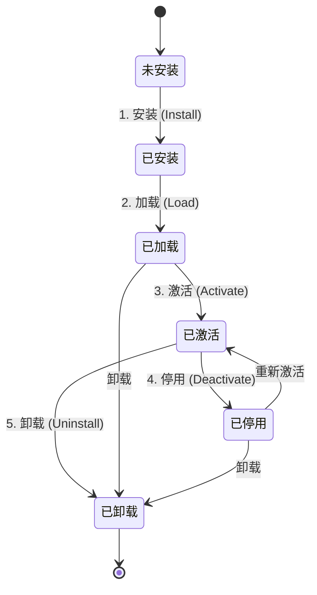

# Tauri AI 聊天应用插件系统设计规范

**版本**: 1.0
**作者**: MiniMax Agent
**日期**: 2025-10-31

---

## 1. 执行摘要

本文档旨在为基于 Tauri 框架的 AI 聊天应用提供一套完整、可扩展且安全的插件系统设计规范。随着 AI 应用功能的日益复杂和用户需求的个性化，构建一个开放、高效、稳定的插件生态系统至关重要。本设计规范在深度研究 Tauri 2.x 核心架构、VSCode 插件系统以及现代插件系统最佳实践的基础上，提出了一套技术栈中立、性能卓越且安全可靠的解决方案。

### 1.1. 设计目标

本插件系统的核心设计目标旨在实现以下几点：
- **技术栈中立**：支持开发者使用 React, Vue, Svelte 等任意现代前端框架开发插件 UI，不与特定技术栈绑定。
- **高性能与低资源占用**：充分利用 Tauri 的原生优势，通过懒加载、内存优化和高效的 IPC 通信，确保插件系统对主应用性能影响降至最低。
- **全面的功能支持**：为插件提供强大的原生能力，包括安全的文件处理、受控的网络请求和可靠的本地存储功能。
- **极致的安全性**：建立一套从用户授权、权限管理到安全隔离的完整安全机制，确保用户数据和系统安全。
- **卓越的开发体验**：提供清晰的 API 接口、详细的开发文档、完善的工具链和热更新支持，降低插件开发门槛。

### 1.2. 核心特性

为实现上述目标，本插件系统具备以下核心特性：
- **微内核架构 (Micro-kernel)**：主应用作为轻量级核心，负责插件生命周期、通信和安全管理，功能逻辑由各插件独立实现。
- **事件驱动与懒加载**：插件基于明确的激活事件（Activation Events）按需加载，显著降低应用启动时间和内存占用。
- **分层设计与清晰边界**：通过分层架构明确前端、插件桥接层、核心插件与 Tauri 后端的职责，确保系统高内聚、低耦合。
- **细粒度的权限管理**：基于“最小权限原则”，提供详细的权限分类和灵活的授权模式，让用户完全掌控插件行为。
- **统一的通信协议**：基于 Tauri 的 Commands, Events 和 Channels 机制，构建了一套类型安全、高效可靠的 IPC 通信规范。

本规范将作为插件系统开发、插件开发者以及生态参与者的权威指南，为构建一个繁荣、稳定、安全的 AI 聊天应用生态奠定坚实基础。

---

## 2. 系统架构总览

本插件系统采用分层架构，将 UI、插件逻辑、核心服务和底层系统能力清晰地解耦。这种设计不仅提升了系统的可维护性和扩展性，也为实现高性能和高安全性提供了架构保障。

### 2.1. 整体架构图

系统整体架构分为四层：前端层、插件桥接层、核心插件层和 Tauri 后端层。各层之间通过定义清晰的接口和 IPC 通信机制进行协作。

```mermaid
graph TD
    subgraph 前端层 (Frontend Layer)
        A1[AI 聊天界面 (React/Vue/Svelte)]
        A2[通用 UI 组件库]
    end

    subgraph 插件桥接层 (Plugin Bridge)
        B1[插件管理器 PluginManager]
        B2[通信协调器 IPC Coordinator]
        B3[生命周期管理器 LifecycleManager]
    end

    subgraph 核心插件层 (Core Plugin Layer)
        C1[文件处理插件 File Plugin]
        C2[网络请求插件 Network Plugin]
        C3[本地存储插件 Storage Plugin]
        C4[...]
    end

    subgraph Tauri 后端层 (Tauri Backend)
        D1[Rust 核心逻辑]
        D2[系统 API 接口]
        D3[权限管理器]
    end

    A1 --> B1
    A2 --> A1
    B1 <--> B2
    B1 <--> B3
    B2 <--> C1
    B2 <--> C2
    B2 <--> C3
    B2 <--> C4
    C1 -- Tauri IPC --> D1
    C2 -- Tauri IPC --> D2
    C3 -- Tauri IPC --> D1
    D1 <--> D3
```

### 2.2. 分层设计详解

- **前端层 (Frontend Layer)**：
  - **职责**：负责所有用户界面的渲染和交互。AI 聊天界面、设置页面以及由插件贡献的 UI 组件均在这一层。
  - **技术栈**：保持技术栈中立，允许使用 React, Vue, Svelte 或其他任何 Web 框架。
  - **交互**：通过插件桥接层提供的 API 与插件系统进行交互，如调用插件功能、渲染插件 UI 等。

- **插件桥接层 (Plugin Bridge)**：
  - **职责**：作为前端与插件核心逻辑之间的“适配器”和“协调者”。它负责管理插件的整个生命周期，协调插件之间的通信，并为前端提供一个统一、稳定的 API 接口。
  - **核心组件**：
    - **插件管理器 (PluginManager)**：负责插件的发现、注册、加载和卸载。
    - **通信协调器 (IPC Coordinator)**：封装 Tauri 的 IPC 通信，提供类型安全的消息传递服务。
    - **生命周期管理器 (LifecycleManager)**：跟踪并管理每个插件的状态（如已加载、已激活、已停用）。

- **核心插件层 (Core Plugin Layer)**：
  - **职责**：实现具体的功能逻辑。插件在此层被执行，并通过插件 API 与主应用及其他插件交互。
  - **实现**：插件可以由前端代码（JavaScript/TypeScript）和后端代码（Rust）共同组成，以满足不同的功能需求。
  - **示例**：文件处理、网络请求、本地存储等核心功能被封装为内置的核心插件，供其他插件调用。

- **Tauri 后端层 (Tauri Backend)**：
  - **职责**：利用 Tauri 框架提供原生能力支持。它执行 Rust 核心逻辑，封装操作系统 API，并实施最终的安全策略。
  - **核心组件**：
    - **Rust 核心逻辑**：执行由插件请求的、需要原生性能或权限的操作。
    - **系统 API 接口**：通过 Tauri 命令（Commands）向插件安全地暴露文件、网络等系统级能力。
    - **权限管理器**：最终执行权限检查和访问控制，是整个安全模型的基石。

### 2.3. 技术栈

- **前端框架**：不限制，支持 React, Vue, Svelte 等主流框架。
- **后端语言**：**Rust**，利用其高性能、内存安全和并发优势。
- **跨平台框架**：**Tauri 2.x**，利用其轻量级、安全和系统原生 WebView 的特性。
- **通信机制**：基于 **Tauri IPC** (Commands, Events, Channels)，并封装成统一的消息协议。
- **数据序列化**：**Serde** (Rust) 和 **JSON**，用于在前后端之间高效、安全地传递数据。
- **本地存储**：**SQLite** (通过 `tauri-plugin-sql`)，提供结构化的本地数据存储能力。
- **插件打包**：采用 **ZIP** 格式，包含 `manifest.json` 清单文件和所有插件资源。

### 2.1. 插件系统核心设计

本插件系统的核心设计借鉴了 VS Code 和其他现代插件化架构的最佳实践，以“微内核 + 插件契约 + 事件总线 + 隔离运行 + 配置与权限”为基石，旨在实现技术栈中立、高度可扩展和安全可靠的目标。

#### 2.1.1. 微内核架构 (Microkernel Architecture)

系统采用微内核架构，也称为“宿主-插件”模式。

*   **宿主 (Host)**：作为核心，宿主应用负责提供最基础、最通用的能力。这包括插件的生命周期管理（加载、卸载、激活、停用）、提供稳定的核心 API 服务（如文件系统访问、网络请求、UI渲染等）、建立通信桥梁以及实施安全策略。宿主本身不包含任何具体的业务功能，从而保持其轻量和稳定。

*   **插件 (Plugins)**：所有的业务功能、特性扩展都通过插件来实现。每个插件都是一个独立的单元，可以被独立开发、部署和更新。插件通过与宿主定义的标准“契约”进行交互，来使用宿主提供的能力并扩展应用功能。

这种架构的优势在于：
*   **高扩展性**：可以轻松地通过添加新插件来引入新功能，而无需修改核心宿主代码。
*   **高稳定性**：插件运行在隔离的环境中，其崩溃或性能问题不会直接影响核心宿主d的稳定性。
*   **灵活性**：允许开发者根据需求选择和组合不同的插件，实现高度定制化的应用。

#### 2.1.2. 扩展点 (Extension Points)

为了让插件能够以一种结构化、可预测的方式扩展应用，我们定义了一系列“扩展点”。扩展点是宿主应用中明确声明的、允许插件注入功能的位置。

本系统设计的核心扩展点包括：

| 扩展点类别 | 描述 | 示例 |
| :--- | :--- | :--- |
| **命令 (Commands)** | 允许插件注册可以被用户、快捷键或其他插件调用的具名操作。 | `plugin.myCommand` |
| **菜单 (Menus)** | 允许插件向应用的不同位置（如上下文菜单、工具栏）添加菜单项。 | `editor/context`, `view/title` |
| **视图/面板 (Views/Panels)** | 允许插件在应用的侧边栏、底部面板等区域贡献自定义的 Webview UI。 | 插件设置页面、自定义信息展示面板 |
| **事件监听器 (Event Listeners)** | 允许插件订阅并响应系统或应用生命周期中的特定事件。 | `onFileOpen`, `onUserLogin` |
| **协议处理器 (Protocol Handlers)** | 允许插件注册自定义协议（如 `my-plugin://`），以处理特定的数据或链接。 | 用于插件内部资源的加载 |
| **生命周期钩子 (Lifecycle Hooks)** | 允许插件在自身的生命周期（如激活、停用）中执行代码。 | `activate`, `deactivate` |

插件通过其 `manifest.json` 文件以声明式的方式注册这些扩展点，宿主在加载插件时读取这些元数据，并动态构建起整个应用的功能。

#### 2.1.3. 插件生命周期管理

系统为每个插件定义了清晰、一致的生命周期，由宿主的 **生命周期管理器 (LifecycleManager)** 负责协调。



**Figure 3: 插件生命周期状态机**

1.  **安装 (Install)**：
    *   **操作**：从插件商店或本地文件下载插件包（通常是 ZIP 文件），进行安全签名验证，然后解压到指定的插件目录。
    *   **产物**：插件文件被放置在 `plugins/<plugin-id>/` 目录下。

2.  **加载 (Load)**：
    *   **操作**：宿主启动或新插件安装后，生命周期管理器会扫描插件目录，读取每个插件的 `manifest.json` 文件。
    *   **检查**：验证清单文件的完整性、依赖项是否满足、声明的权限是否合规。
    *   **状态**：此时插件已注册到系统中，但尚未分配计算资源，也未执行任何代码。这是一种低成本的“懒加载”状态。

3.  **激活 (Activate)**：
    *   **操作**：执行插件的入口文件（`main.js` 或 `index.js`）中定义的 `activate` 函数。这是插件的“启动”阶段，会在这里进行初始化、注册命令、订阅事件等。
    *   **触发条件**：
        *   **事件激活 (Activation Events)**：当 `manifest.json` 中声明的激活事件之一发生时（如 `onCommand:plugin.myCommand`）。这是推荐的方式，可以实现按需激活，优化性能。
        *   **用户手动激活**：用户在 UI 上明确启用了某个插件。
        *   **启动时激活**：为核心或高频插件配置为应用启动时即激活。

4.  **停用 (Deactivate)**：
    *   **操作**：当插件被禁用、卸载或应用关闭时，执行插件入口文件中定义的 `deactivate` 函数。
    *   **职责**：插件必须在此钩子中清理所有资源，如取消事件订阅、清除定时器、关闭网络连接等，以防止内存泄漏。

5.  **卸载 (Uninstall)**：
    *   **操作**：首先执行停用逻辑，然后从文件系统中删除插件目录，并清理相关的用户配置和缓存数据。

这种基于事件的懒加载和激活机制，是保障应用启动速度和降低闲置资源占用的关键。

## 3. 插件接口规范 (Plugin Interface Specification)

插件接口（API）是连接宿主应用和插件的桥梁，其设计的清晰性、一致性和稳定性直接决定了插件生态的健康发展。本规范定义了一套完整的、面向插件开发者的 API，旨在提供强大功能的同时，保证系统的安全与稳定。

所有提供给插件的 API 都将通过一个全局的 `plugin` 对象暴露，开发者可以通过 `plugin.apiName` 的方式调用。

### 3.1. 核心 API (`plugin.core`)

核心 API 提供了插件与宿主进行基础交互的能力，包括获取插件上下文、版本信息等。

```typescript
/**
 * 插件核心 API
 */
interface CoreAPI {
    /**
     * 获取当前插件的上下文信息。
     */
    getContext(): Promise<PluginContext>;

    /**
     * 获取宿主应用的信息。
     */
    getHostInfo(): Promise<HostInfo>;
}

/**
 * 插件上下文信息
 */
interface PluginContext {
    /**
     * 插件的唯一 ID。
     */
    pluginId: string;

    /**
     * 插件的版本号。
     */
    version: string;

    /**
     * 插件的配置信息。
     */
    config: Record<string, any>;

    /**
     * 插件的数据存储路径。
     */
    storagePath: string;
}

/**
 * 宿主应用信息
 */
interface HostInfo {
    /**
     * 宿主应用名称，例如 "Tauri AI Chat"。
     */
    name: string;

    /**
     * 宿主应用版本号。
     */
    version: string;

    /**
     * 当前运行平台，例如 "windows" | "macos" | "linux"。
     */
    platform: string;
}
```

### 3.2. 通信 API (`plugin.ipc`)

通信 API 是插件与宿主、插件与插件之间进行数据交换的核心。它基于 Tauri 的 IPC 机制（Commands, Events, Channels）进行了封装，提供了类型安全、简单易用的接口。

```typescript
/**
 * 插件 IPC 通信接口
 */
interface PluginIPC {
    /**
     * 调用宿主或其他插件注册的 Command。
     * @param command - 命令名称, 格式如 `pluginId.commandName` 或 `host.commandName`。
     * @param args - 命令参数。
     * @returns 返回一个 Promise，解析为命令的执行结果。
     */
    invoke<T>(command: string, args?: any): Promise<T>;

    /**
     * 监听一个事件。
     * @param event - 事件名称。
     * @param handler - 事件处理函数。
     * @returns 返回一个取消监听的函数。
     */
    on<T>(event: string, handler: (data: T) => void): () => void;

    /**
     * 触发一个事件。
     * @param event - 事件名称。
     * @param data - 事件负载。
     */
    emit<T>(event: string, data: T): void;
}
```

### 3.3. 生命周期钩子 (Lifecycle Hooks)

插件的 `main.js` 或 `index.js` 文件必须导出一个包含 `activate` 和 `deactivate` 方法的对象。这是插件生命周期管理的核心。

```typescript
/**
 * 插件入口模块必须导出的接口
 */
export interface PluginEntry {
    /**
     * 激活插件时调用的函数。
     * 插件的初始化逻辑，如注册命令、监听事件、创建 UI 等，应在此处执行。
     * @param context - 插件的上下文信息。
     */
    activate(context: PluginContext): void | Promise<void>;

    /**
     * 停用插件时调用的函数。
     * 插件必须在此函数中清理所有资源，例如移除事件监听器、清除定时器、关闭网络连接等，以防止内存泄漏。
     */
    deactivate(): void | Promise<void>;
}
```

### 3.4. 功能扩展 API (Feature Extension APIs)

为了赋能插件实现更复杂的功能，系统提供了一系列封装好的功能模块 API。

#### 3.4.1. 文件系统 API (`plugin.fs`)

提供了一个带权限控制的安全文件系统访问接口，所有路径都将被限制在插件自身的数据目录下，防止越权访问。

```typescript
/**
 * 安全的文件系统 API
 */
interface FileSystemAPI {
    /**
     * 读取文件内容。
     * @param path - 相对于插件数据目录的文件路径。
     * @param encoding - 文件编码, 默认为 'utf-8'。
     * @returns 返回文件内容的 Promise。
     */
    readFile(path: string, encoding?: string): Promise<string | Uint8Array>;

    /**
     * 写入文件。
     * @param path - 相对于插件数据目录的文件路径。
     * @param data - 要写入的数据。
     */
    writeFile(path: string, data: string | Uint8Array): Promise<void>;

    /**
     * 读取目录内容。
     * @param path - 相对于插件数据目录的目录路径。
     * @returns 返回目录下的文件和子目录信息列表。
     */
    readDir(path: string): Promise<FileInfo[]>;

    /**
     * 创建目录。
     * @param path - 相对于插件数据目录的目录路径。
     */
    createDir(path: string): Promise<void>;

    /**
     * 删除文件或目录。
     * @param path - 相对于插件数据目录的路径。
     */
    remove(path: string): Promise<void>;

    /**
     * 检查路径是否存在。
     * @param path - 相对于插件数据目录的路径。
     */
    exists(path: string): Promise<boolean>;
}

interface FileInfo {
    name: string;
    path: string;
    isDirectory: boolean;
    size: number;
}
```

#### 3.4.2. 网络 API (`plugin.network`)

提供了一个统一的网络请求接口，所有请求都将通过宿主的网络代理层，以实现安全审计、缓存和速率限制。

```typescript
/**
 * 安全的网络请求 API
 */
interface NetworkAPI {
    /**
     * 发起一个 HTTP 请求。
     * @param options - 请求配置。
     * @returns 返回一个包含响应数据的 Promise。
     */
    request(options: RequestOptions): Promise<HttpResponse>;
}

interface RequestOptions {
    method: 'GET' | 'POST' | 'PUT' | 'DELETE' | 'PATCH';
    url: string;
    headers?: Record<string, string>;
    params?: Record<string, any>;
    data?: any;
    timeout?: number; // ms
}

interface HttpResponse<T = any> {
    status: number;
    statusText: string;
    headers: Record<string, string>;
    data: T;
}
```

#### 3.4.3. 数据存储 API (`plugin.storage`)

提供了一个简单的键值对（Key-Value）存储 API，用于持久化插件的配置和数据。数据在物理上是隔离的。

```typescript
/**
 * 持久化数据存储 API
 */
interface StorageAPI {
    /**
     * 存储一个键值对。
     * @param key - 键。
     * @param value - 值。值必须是可序列化为 JSON 的类型。
     */
    setItem(key: string, value: any): Promise<void>;

    /**
     * 根据键获取一个值。
     * @param key - 键。
     * @returns 返回存储的值，如果不存在则返回 null。
     */
    getItem<T>(key: string): Promise<T | null>;

    /**
     * 根据键删除一个键值对。
     * @param key - 键。
     */
    removeItem(key: string): Promise<void>;

    /**
     * 清空该插件的所有存储数据。
     */
    clear(): Promise<void>;
}
```

#### 3.4.4. UI 扩展 API (`plugin.ui`)

UI 扩展 API 允许插件向主应用界面贡献自定义的视图、组件和样式，是实现功能可视化的关键。

```typescript
/**
 * UI 扩展 API
 */
interface UI_API {
    /**
     * 在应用的指定区域注册一个自定义视图（Webview Panel）。
     * @param viewId - 视图的唯一 ID。
     * @param options - 视图配置选项。
     * @returns 返回一个可以控制该视图的对象。
     */
    registerView(viewId: string, options: ViewOptions): Promise<ViewHandle>;

    /**
     * 在工具栏注册一个按钮。
     * @param buttonId - 按钮的唯一 ID。
     * @param options - 按钮配置选项。
     */
    registerToolbarButton(buttonId: string, options: ToolbarButtonOptions): Promise<void>;

    /**
     * 显示一条通知消息。
     * @param message - 消息内容。
     * @param options - 通知选项。
     */
    showNotification(message: string, options?: NotificationOptions): Promise<void>;
}

interface ViewOptions {
    /** 视图将要显示的位置 */
    location: 'sidebar' | 'panel';
    /** 视图的标题 */
    title: string;
    /** 视图的图标 */
    icon?: string;
    /** Webview 的 HTML 内容或 URL */
    html: string;
}

interface ToolbarButtonOptions {
    /** 按钮的图标 */
    icon: string;
    /** 鼠标悬停提示 */
    tooltip: string;
    /** 点击时执行的命令 ID */
    command: string;
}

interface NotificationOptions {
    /** 通知级别 */
    level: 'info' | 'warning' | 'error';
}
```

## 4. 插件加载与管理 (Plugin Loading and Management)

插件的加载与管理是保证系统高性能、高稳定性和高安全性的关键环节。本系统设计了一套从插件包结构、解析验证到动态加载、内存管理和热更新的完整机制。

### 4.1. 插件包规范

为了实现标准化和自动化，所有插件都必须打包成一个 `.zip` 文件，并遵循统一的内部结构。

#### 4.1.1. ZIP 包目录结构

一个标准的插件包应包含以下文件和目录：

```
my-plugin.zip/
├── manifest.json          # 插件清单文件（必需）
├── index.js               # 插件主入口文件（必需）
├── assets/                # 静态资源目录（图片、字体等）
├── modules/               # 可懒加载的子模块
├── locales/               # 国际化语言文件
└── signature.asc          # GPG 或其他方式的数字签名文件
```

#### 4.1.2. 插件清单 (`manifest.json`)

`manifest.json` 是插件的“身份证”，以声明式的方式描述了插件的元数据、能力、激活条件和依赖关系。宿主应用通过解析此文件来了解和集成插件。

一个典型的 `manifest.json` 结构如下：

```json
{
  "name": "my-ai-plugin",
  "version": "1.0.0",
  "displayName": "My AI Plugin",
  "description": "A plugin that does amazing AI things.",
  "main": "./index.js",
  "author": "Developer Name",
  "host": {
    "version": "^1.0.0" // 要求宿主应用的兼容版本
  },
  "activationEvents": [
    "onCommand:my-ai-plugin.run",
    "onView:my-ai-plugin-sidebar"
  ],
  "contributes": {
    "commands": [
      {
        "command": "my-ai-plugin.run",
        "title": "Run AI Analysis"
      }
    ],
    "views": {
      "sidebar": [
        {
          "id": "my-ai-plugin-sidebar",
          "title": "AI Assistant"
        }
      ]
    }
  },
  "permissions": [
    "network:request",
    "fs:read",
    "storage:readWrite"
  ]
}
```

*   **`activationEvents`**: 定义了插件的“懒加载”触发条件。只有当这些事件发生时，插件才会被激活，从而极大地优化了应用启动性能。
*   **`contributes`**: 声明了插件向系统贡献的所有功能点，如命令、视图、菜单等。
*   **`permissions`**: 明确列出插件运行所需的权限，用于实现安全管控。

### 4.2. 插件加载流程

插件的加载流程由**插件加载器 (PluginLoader)** 精心协调，确保每一步都安全、高效。

1.  **解析与验证 (Parse & Verify)**
    *   **解压**：将 `.zip` 包解压到内存或临时目录。
    *   **签名验证**：使用 `signature.asc` 文件对插件包的完整性进行加密验证，确保插件未被篡改。
    *   **清单解析**：读取并解析 `manifest.json`，检查其结构和内容的合法性。
    *   **依赖与兼容性检查**：根据 `manifest.json` 中的 `host` 和 `dependencies` 字段，检查插件是否与当前宿主版本兼容，以及其依赖的插件是否已满足。

2.  **动态加载与懒加载 (Dynamic & Lazy Loading)**
    *   **按需激活**：插件的加载严格遵循 `activationEvents` 中定义的懒加载策略。例如，只有当用户点击了某个菜单项或执行了某个命令时，对应的插件才会被真正加载和执行其 `activate` 函数。
    *   **模块懒加载**：插件内部可以进一步通过动态 `import()` 来懒加载其功能模块（如 `modules/` 目录下的文件），从而将插件的启动时间降至最低。
    *   **加载优先级**：系统可以根据插件的类型（如核心插件、UI插件）、用户使用频率和 `manifest.json` 中定义的优先级，动态调整插件的加载顺序，优先加载用户立即需要的功能。

### 4.3. 内存管理与垃圾回收

为了防止内存泄漏并保持应用轻快，插件系统实施了严格的内存管理策略。

*   **内存监控**：宿主会定期监控每个插件的内存占用情况。当发现内存使用异常（如持续增长或超出阈值）时，会发出警告，甚至在极端情况下停用该插件。

*   **资源清理**：插件在 `deactivate` 钩子中必须负责清理其创建的所有资源，例如：
    *   取消事件监听器。
    *   清除 `setInterval` 和 `setTimeout` 等定时器。
    *   关闭网络连接和数据库连接。
    *   销毁创建的 UI 组件。

*   **智能垃圾回收 (GC)**：对于长时间未使用且没有被引用的“非激活”插件，系统会将其标记为可回收。在适当的时机（如系统空闲时），内存管理器会主动卸载这些插件的模块，释放其占用的内存，并在需要时重新加载。

### 4.4. 插件热更新 (Hot Update)

系统支持插件的热更新，允许用户在不重启应用的情况下更新插件到新版本，提供了流畅的用户体验。

*   **更新检查**：宿主定期或在用户触发时，向插件商店检查已安装插件的新版本。
*   **原子性更新**：更新过程是原子性的，以保证系统的稳定性。
    1.  **下载新版**：在后台下载新版本的插件包。
    2.  **停用旧版**：调用旧版本插件的 `deactivate` 函数，释放其占用的资源。
    3.  **切换文件**：将插件目录下的文件原子性地替换为新版本的文件。
    4.  **加载新版**：重新加载新版本的插件，并根据需要激活。
*   **更新回滚**：如果在加载或激活新版本的过程中发生任何错误，系统会自动回滚到更新前的旧版本，并将错误报告给用户和开发者，确保插件的可用性不受影响。

## 5. 通信机制设计 (Communication Mechanism Design)

插件与宿主、插件与插件之间的通信是插件系统架构的“神经网络”。本设计基于 Tauri 强大的 IPC（Inter-Process Communication）能力，构建了一个安全、高效、易于扩展的通信层。

### 5.1. 通信架构概览

通信的核心是前端（WebView，运行插件的 JavaScript 代码）与后端（Tauri Core，运行 Rust 代码）之间的隔离与交互。所有高风险、需要访问系统原生能力的操作都必须通过后端执行，前端通过标准化的 IPC 接口请求这些能力。

```mermaid
graph TD
    A[插件前端 (JavaScript)] -- IPC 请求 --> B(Tauri IPC 桥)
    B -- Rust 调用 --> C{插件后端逻辑 (Rust)}
    C -- 权限检查 --> D[权限管理器]
    C -- 调用 --> E[系统原生 API]
    E -- 返回结果 --> C
    C -- IPC 响应 --> B
    B -- Promise resolve --> A
```
**Figure 4: 插件通新架构流程图**

### 5.2. IPC 原语的运用

Tauri 提供了三种核心的 IPC 原语，本系统对它们进行了合理的分工和封装，以适应不同的通信场景。

| IPC 原语 | 推荐使用场景 | 特点 | 封装的 API |
| :--- | :--- | :--- | :--- |
| **Commands** | **请求-响应模式**：插件需要调用一个后端函数并等待其返回结果。 | 类似于异步函数调用（`async/await`），支持类型安全的参数和返回值，是插件获取后端能力的主要方式。 | `plugin.ipc.invoke()` |
| **Events** | **单向广播模式**：后端需要通知前端某个状态发生了变化，或者一个任务已完成。 | 轻量、高效，适合一对多的通知场景，但不保证消息的可靠送达。 | `plugin.ipc.on()`, `plugin.ipc.emit()` |
| **Channels** | **持久化双向通道**：需要建立一个持续的、低延迟的双向数据流。 | 非常适合流式 AI 响应、实时日志、文件传输进度等场景。 | `plugin.ipc.createChannel()` (高级 API) |

### 5.3. 消息协议

为了保证通信的结构化和可追溯性，所有通过 IPC 传递的消息都遵循统一的格式。

#### 5.3.1. 请求消息格式

当插件通过 `plugin.ipc.invoke()` 发起请求时，消息体如下：

```typescript
interface IPCRequest {
    /** 消息的唯一 ID，用于追踪响应 */
    id: string;
    /** 消息类型 */
    type: 'request';
    /** 调用的命令名称 */
    command: string;
    /** 传递的参数 */
    payload: any;
    /** 发起请求的插件 ID */
    sourcePluginId: string;
    /** 时间戳 */
    timestamp: number;
}
```

#### 5.3.2. 响应消息格式

后端处理完请求后，返回的响应消息体如下：

```typescript
interface IPCResponse {
    /** 对应请求消息的 ID */
    id: string;
    /** 消息类型 */
    type: 'response';
    /** 请求是否成功处理 */
    success: boolean;
    /** 成功时返回的数据 */
    data?: any;
    /** 失败时的错误信息 */
    error?: {
        code: string;
        message: string;
    };
    /** 时间戳 */
    timestamp: number;
}
```

#### 5.3.3. 事件消息格式

当通过 `plugin.ipc.emit()` 或从后端广播事件时，消息体如下：

```typescript
interface IPCEvent {
    /** 事件的唯一 ID */
    id: string;
    /** 消息类型 */
    type: 'event';
    /** 事件名称 */
    eventName: string;
    /** 事件负载数据 */
    payload: any;
    /** 时间戳 */
    timestamp: number;
}
```

### 5.4. 消息路由与安全

所有 IPC 消息都由后端的一个**消息路由器 (Message Router)** 统一处理和分发，这是保障通信安全的关键。

*   **权限验证**：消息路由器在接收到请求后，首先会根据 `sourcePluginId` 和 `command` 名称，查询**权限管理器 (PermissionManager)**，检查该插件是否有权限执行此命令。如果无权访问，请求将被直接拒绝。
*   **目标路由**：验证通过后，路由器会将请求分发给对应的后端处理函数（Command Handler）。
*   **输入验证**：每个 Command Handler 在执行前都会对传入的 `payload` 进行严格的类型和内容验证，防止恶意输入导致的安全漏洞。
*   **日志与审计**：所有重要的 IPC 通信都会被记录到审计日志中，便于追踪和排查问题。

### 5.5. 插件间通信

插件之间的直接通信是被严格限制的，以防止插件间形成不稳定的强依赖关系。推荐的插件间通信方式是基于“发布-订阅”模式的事件机制。

*   **通过共享事件**：插件 A 可以通过 `plugin.ipc.emit('custom-event-name', data)` 触发一个公共事件，而插件 B 可以通过 `plugin.ipc.on('custom-event-name', handler)` 来监听并响应该事件。这种方式是松耦合的，一个插件不需要知道另一个插件的存在。

*   **通过命令调用**：如果需要进行更直接的交互，一个插件可以调用另一个插件暴露的命令。例如，插件 B 注册了 `pluginB.doSomething` 命令，插件 A 可以通过 `plugin.ipc.invoke('pluginB.doSomething', args)` 来调用它。这种方式需要插件 A 明确知道插件 B 的存在和其提供的命令接口。

## 6. 安全机制设计 (Security Mechanism Design)

安全是插件系统的生命线。一个不可靠的插件可能会威胁到用户数据的隐私、系统稳定性甚至执行恶意代码。因此，本系统从设计之初就构建了多层次、纵深防御的安全架构，其核心原则是 **“默认不信任，最小权限” (Zero Trust & Least Privilege)**。

### 6.1. 权限模型与分类

系统定义了一套细粒度的权限分类体系，插件必须在其 `manifest.json` 文件中明确声明它所需要的每一项权限。未经声明的权限，在任何情况下都不会被授予。

#### 6.1.1. 权限分类

权限被划分为以下几个大类：

| 权限大类 | 典型权限示例 | 描述 |
| :--- | :--- | :--- |
| **文件系统** | `fs:read`, `fs:write` | 控制对本地文件和目录的读写访问。 |
| **网络** | `network:request` | 控制发起 HTTP/HTTPS 请求的能力。 |
| **数据存储** | `storage:readWrite` | 控制对插件私有存储区域的读写。 |
| **系统与设备** | `system:clipboard`, `system:notifications` | 控制对剪贴板、系统通知、摄像头等敏感系统资源的访问。 |
| **UI与交互** | `ui:createView` | 控制创建自定义视图、弹窗等界面元素的能力。 |

#### 6.1.2. 权限级别

为了让用户更好地理解风险，每项权限都被赋予了一个风险级别：

*   **低风险 (Low Risk)**：通常是只读的、不涉及个人敏感信息的操作，如读取插件自身配置。
*   **中风险 (Medium Risk)**：可能涉及用户数据的操作，但影响范围有限，如向插件私有目录写入文件。
*   **高风险 (High Risk)**：可能访问敏感数据或执行高危操作，如读取用户任意文件、向任意域名发送请求。

在请求授权时，系统会根据权限级别，以不同强度的 UI（如颜色、警告信息）来提示用户。

### 6.2. 用户授权机制

用户的明确授权是插件获得权限的唯一途径。系统设计了清晰、分层的用户授权流程。

#### 6.2.1. 安装时授权

当用户安装一个插件时，系统会弹出一个权限申请对话框，清晰地列出该插件声明的所有权限及其风险级别。用户可以：
*   **查看详情**：点击每一项权限，查看其具体用途、潜在风险和开发者提供的说明。
*   **选择性授予**：用户可以只授予一部分权限，而不是“全有或全无”。
*   **一键拒绝**：如果用户不信任该插件，可以拒绝所有权限并取消安装。

#### 6.2.2. 运行时动态授权

对于特别敏感的权限（如访问摄像头、麦克风），即使在安装时已被授予，插件在每次实际使用前，系统仍会弹出实时授权提示（Prompt），请求用户再次确认。用户可以选择“仅允许一次”或“始终允许”。

#### 6.2.3. 权限管理中心

用户可以随时在应用的“设置”->“插件权限管理”中心查看所有已安装插件的权限授予情况，并可以随时进行以下操作：
*   **撤销权限**：随时撤销已经授予给某个插件的任何权限。
*   **修改权限**：调整权限的授予范围，例如将文件访问权限从“所有文件”限制为“仅限下载目录”。
*   **暂停插件**：一键禁用某个插件的所有活动。

### 6.3. 插件沙盒 (Plugin Sandbox)

为了从根本上限制插件的行为，所有插件的前端代码都运行在一个受限的 **沙盒 (Sandbox)** 环境中。这个沙盒是通过以下技术实现的：

*   **Webview 隔离**：每个插件的关键 UI 都运行在独立的 Webview 实例中，拥有自己独立的 JavaScript 上下文，与其他插件和主应用隔离。
*   **受限的全局 API**：在插件的 JavaScript 环境中，诸如 `eval()`、`new Function()` 等危险的全局函数被移除或重写。
*   **API 代理**：插件不能直接访问浏览器或 Node.js 的原生 API。所有对外部资源（文件、网络、存储）的访问都必须通过前面定义的 `plugin.*` 代理 API。这些 API 内部封装了权限检查和安全审计的逻辑。

### 6.4. 运行时安全监控

系统在运行时会对插件的行为进行持续监控，以发现和阻止潜在的恶意活动。

*   **权限使用追踪**：每一次插件使用权限的尝试（无论成功或失败）都会被记录下来。系统会分析这些使用模式，例如，一个笔记插件突然开始高频次地请求网络，这将被标记为异常行为并触发警报。
*   **内容安全策略 (CSP)**：Webview 中加载的所有内容都受到严格的 CSP 限制，防止跨站脚本（XSS）攻击和不安全的资源加载。
*   **代码签名与验证**：在“插件加载”环节已经提到，所有插件包都必须经过数字签名。在加载时，系统会验证签名以确保代码未被篡改。
*   **异常检测**：通过机器学习模型分析插件的行为模式（如 API 调用频率、数据传输量、资源使用情况），与基线行为进行对比，以识别潜在的“零日攻击”或未知威胁。

### 6.5. 日志与审计

所有与安全相关的事件，包括权限的授予、拒绝、撤销和使用，都会被记录在结构化的安全审计日志中。这为事后追溯、问题排查和合规性检查提供了坚实的基础。

## 7. 性能优化策略 (Performance Optimization Strategy)

一个优秀的插件系统不仅要功能强大，还必须保证应用的性能和响应速度不受影响。本系统在架构的各个层面都融入了性能优化的考量，旨在实现“快、稳、省”的目标。

### 7.1. 启动性能优化：懒加载与按需激活

应用启动速度是用户体验的第一道关卡。本系统借鉴了 VS Code 的核心思想，将 **懒加载（Lazy Loading）** 作为性能优化的基石。

*   **核心原则**：除非绝对必要，否则不在启动时加载任何插件。
*   **实现方式**：通过 `manifest.json` 文件中的 `activationEvents` 字段实现。插件只有在用户执行了特定命令、打开了特定文件类型或激活了特定视图时，才会被加载和执行其 `activate()` 方法。
*   **效果**：这种“按需激活”的机制，使得即使安装了大量插件，应用的启动速度也能保持接近原生应用的水平，因为启动时几乎没有额外的代码需要执行。

### 7.2. 运行时性能：资源管理与监控

#### 7.2.1. 内存管理

*   **内存监控**：宿主应用会持续监控每个插件的内存占用情况。通过设置合理的警告阈值和上限阈值，可以及时发现内存泄漏或内存使用异常的插件。
*   **资源回收**：当插件被停用（deactivate）时，它必须释放其占用的所有资源。系统会通过钩子机制强制执行清理逻辑。对于长时间处于非活动状态的插件，系统会执行垃圾回收，主动卸载其代码和资源，释放内存。
*   **缓存策略**：对于插件请求的资源（如网络数据、文件内容），系统提供了一套智能缓存机制。通过 LRU（Least Recently Used）等策略，在提升重复访问速度的同时，避免缓存占用过多内存。

#### 7.2.2. CPU 使用限制

*   **耗时任务隔离**：插件中任何可能长时间占用 CPU 的计算密集型任务，都应被放置在 Web Worker 中执行，以避免阻塞主 UI 线程，保证界面的流畅响应。
*   **CPU 时间片监控**：系统会监控每个插件的 CPU 使用时间。如果某个插件持续占用过多 CPU 资源，系统会降低其执行优先级，并在必要时向用户发出警告，建议停用该插件。

### 7.3. 响应速度优化：异步处理与代码分割

*   **全面的异步化**：所有可能产生延迟的 I/O 操作，如文件读写、网络请求，都必须设计为异步 API（返回 Promise）。这保证了插件在等待这些操作完成时，不会冻结用户界面。
*   **代码分割与动态导入**：鼓励插件开发者在其内部也采用代码分割技术。例如，一个复杂的插件可以将其功能拆分成多个小模块，只在用户访问特定功能时，才通过动态 `import()` 加载对应的代码块，而不是在激活时一次性加载所有代码。

### 7.4. 网络性能优化

*   **请求代理与缓存**：所有网络请求都通过后端的网络代理模块。该模块会自动缓存可缓存的响应（如 GET 请求），当插件再次请求相同资源时，可以直接从缓存中快速返回，减少不必要的网络延迟和流量消耗。
*   **请求合并与防抖**：在某些场景下，系统可以智能地将来自不同插件的、对同一域名的多个请求合并为一个，或者对短时间内的重复请求进行防抖（debounce）处理，以减少网络连接的开销。
*   **流式处理**：对于大文件下载或 AI 模型返回的长文本，系统优先采用流式处理（Streaming），允许数据在到达时被分块处理，而不是等待所有数据都下载完毕再开始处理，这极大地改善了大数据量场景下的用户感知响应速度。

### 7.5. 热更新机制的性能考量

在“插件加载与管理”部分提到的热更新机制，本身也是性能优化的一环。通过在后台完成新版本的下载和准备工作，并在合适的时机（如应用空闲时）执行原子性的切换，热更新过程对用户的影响被降至最低，避免了因更新而导致的应用卡顿或需要重启的糟糕体验。

## 8. 实现指南 (Implementation Guide)

本章节为插件开发者提供一个简明扼要的指南，帮助他们快速开始创建、开发、调试和发布一个遵循本规范的 Tauri AI 聊天应用插件。

### 8.1. 开发环境搭建

1.  **安装先决条件**：
    *   Node.js (LTS 版本)
    *   Rust 工具链 (通过 `rustup` 安装)
    *   Tauri CLI (`cargo install tauri-cli`)

2.  **获取插件脚手架**：
    我们将提供一个官方的插件脚手架工具，来快速生成一个符合规范的插件项目模板。
    ```bash
    npm create tauri-plugin my-ai-plugin --template ai-chat
    ```

3.  **项目结构概览**：
    脚手架生成的项目将包含以下基本结构：
    ```
    my-ai-plugin/
    ├── manifest.json       # 插件清单，核心配置文件
    ├── index.js            # 插件的入口文件
    ├── src/
    │   └── ui/             # React/Vue/Svelte UI 组件
    ├── tauri-src/          # Tauri 后端 Rust 代码 (可选)
    ├── package.json        # Node.js 依赖管理
    └── README.md           # 插件说明文档
    ```

### 8.2. 插件开发流程

#### 8.2.1. 第一步：定义 `manifest.json`

这是插件开发的起点。清晰地定义插件的元数据、激活事件、贡献点和所需权限。

**示例：**
```json
{
  "name": "code-highlighter",
  "version": "1.0.0",
  "displayName": "Code Highlighter",
  "main": "./index.js",
  "activationEvents": [
    "onMessageWithCodeBlock"
  ],
  "contributes": {
    "commands": [
      {
        "command": "code-highlighter.toggle",
        "title": "Toggle Code Highlighting"
      }
    ]
  },
  "permissions": [
    "storage:readWrite" 
  ]
}
```

#### 8.2.2. 第二步：实现生命周期钩子

在 `index.js` 中，实现 `activate` 和 `deactivate` 函数。

```javascript
// index.js

// 假设我们有一个全局的 plugin API 对象
const plugin = global.pluginApi;

export function activate(context) {
    console.log('Code Highlighter plugin is now active!');

    // 注册命令
    const disposable = plugin.ipc.on('code-highlighter.toggle', () => {
        // 执行切换高亮的逻辑
        console.log('Toggling code highlight!');
    });

    // 将需要清理的资源添加到 context.subscriptions
    // 系统会在插件停用时自动调用它们的 dispose 方法
    context.subscriptions.push(disposable);
}

export function deactivate() {
    console.log('Code Highlighter plugin is now deactivated.');
    // 这里的清理工作将由 context.subscriptions 自动完成
}
```

#### 8.2.3. 第三步：开发 UI 组件 (如果需要)

如果插件需要提供自定义 UI，可以在 `src/ui/` 目录下使用你熟悉的前端框架（如 React）来开发组件。这些组件可以被注册为侧边栏视图或面板。

#### 8.2.4. 第四步：开发后端逻辑 (如果需要)

如果插件需要执行原生功能，可以在 `tauri-src/` 目录下编写 Rust 代码，并通过 Tauri 的 `#[tauri::command]` 宏将其暴露为可供前端调用的命令。

```rust
// tauri-src/lib.rs

#[tauri::command]
fn my_native_command(argument: String) -> String {
  println!("Called from the frontend with: {}", argument);
  "Hello from Rust!".into()
}

#[cfg_attr(mobile, tauri::mobile_entry_point)]
pub fn run() {
  tauri::Builder::default()
    .invoke_handler(tauri::generate_handler![my_native_command])
    .run(tauri::generate_context!())
    .expect("error while running tauri application");
}
```

然后，在前端通过 `plugin.ipc.invoke()` 调用它：
```javascript
async function callNative() {
    const result = await plugin.ipc.invoke('my_native_command', { argument: 'some data' });
    console.log(result); // 将打印 "Hello from Rust!"
}
```

### 8.3. 调试插件

*   **前端调试**：Tauri 应用在开发模式下，你可以像调试普通网页一样，通过右键 -> “检查”来打开 Webview 的开发者工具，进行断点调试、查看控制台输出和网络请求。
*   **后端调试**：Rust 代码可以通过标准的 `cargo` 工具链和你的 IDE（如 VS Code with rust-analyzer）进行调试。
*   **插件日志**：使用 `console.log` 或更专业的日志库在你的插件代码中输出信息，这些信息将显示在 Webview 的开发者工具控制台中。

### 8.4. 打包与发布

1.  **打包**：执行打包命令，脚手架工具会自动将你的插件项目打包成一个遵循规范的 `.zip` 文件。
    ```bash
    npm run package
    ```
2.  **发布**：将打包好的 `.zip` 文件上传到插件商店。在上传时，你需要提供插件的详细描述、截图、更新日志等信息，并对插件进行数字签名，以供商店审核和验证。

### 8.5. 最佳实践

*   **保持单一职责**：让你的插件专注于做好一件事。
*   **性能优先**：尽可能使用 `activationEvents` 来实现懒加载。对于耗时操作，使用 Web Worker 或异步 API。
*   **用户体验至上**：为你的功能提供清晰的加载状态、错误提示和进度指示。
*   **明确声明权限**：只在 `manifest.json` 中申请插件真正需要的最小权限集。
*   **妥善处理资源**：务必在 `deactivate` 函数中清理所有监听器、定时器和连接。
*   **编写清晰文档**：在 `README.md` 中详细说明你的插件如何使用、配置以及它提供的所有功能。

## 9. 附录 (Appendices)

### 9.1. 附录 A: `manifest.json` 完整字段参考

| 字段 | 类型 | 必需 | 描述 |
| :--- | :--- | :--- | :--- |
| `name` | `string` | 是 | 插件的唯一标识符，应使用 `kebab-case` 格式。 |
| `version` | `string` | 是 | 插件的版本号，遵循 [SemVer](https://semver.org/) 规范。 |
| `displayName` | `string` | 是 | 显示在 UI 上的插件名称。 |
| `description` | `string` | 是 | 插件的简短描述，用于插件商店列表。 |
| `main` | `string` | 是 | 插件的入口 JavaScript 文件路径。 |
| `author` | `string` | 否 | 插件作者的姓名或组织。 |
| `license` | `string` | 否 | 插件的许可证，如 "MIT"。 |
| `homepage` | `string` | 否 | 插件的项目主页 URL。 |
| `repository` | `object` | 否 | 插件的代码仓库信息 (e.g., `{ "type": "git", "url": "..." }`)。 |
| `host` | `object` | 是 | 定义插件所兼容的宿主应用版本，如 `{ "version": "^1.2.0" }`。 |
| `activationEvents` | `string[]` | 否 | 一组用于懒加载和激活插件的事件。如果为空，插件将在启动时激活。 |
| `contributes` | `object` | 否 | 插件向系统贡献的所有功能点，如命令、菜单、视图等。 |
| `permissions` | `string[]` | 否 | 插件运行所需的权限列表。 |
| `dependencies` | `object` | 否 | 插件依赖的其他插件及其版本范围。 |

### 9.2. 附录 B: 权限列表详解

| 权限字符串 | 风险级别 | 描述 |
| :--- | :--- | :--- |
| `fs:read` | 高 | 允许读取用户文件系统中的文件。需要指定可访问的目录范围。 |
| `fs:write` | 高 | 允许写入文件到用户文件系统。需要指定可访问的目录范围。 |
| `network:request`| 中 | 允许向网络发送 HTTP/HTTPS 请求。需要声明可访问的域名白名单。 |
| `network:websocket`| 中 | 允许建立 WebSocket 连接。 |
| `storage:readWrite`| 低 | 允许读写插件自身的、隔离的本地存储空间。 |
| `system:clipboard:read`| 中 | 允许读取用户剪贴板的内容。 |
| `system:clipboard:write`| 低 | 允许向用户剪贴板写入内容。 |
| `system:notifications`| 低 | 允许向用户显示系统级通知。 |
| `ui:createView`| 低 | 允许创建自定义的 Webview 视图或面板。 |
| `device:camera`| 高 | 允许访问摄像头设备。需要运行时动态授权。 |
| `device:microphone`| 高 | 允许访问麦克风设备。需要运行时动态授权。 |

### 9.3. 附录 C: 核心 API 示例代码

这是一个简单的插件示例，演示了如何使用核心 API 来注册一个命令、显示通知和读写插件存储。

```javascript
// my-simple-plugin/index.js

// 假设全局 API 对象已注入
const { ipc, ui, storage } = global.pluginApi;

export function activate(context) {

    // 1. 注册一个命令
    const commandDisposable = ipc.on('my-simple-plugin.sayHello', async () => {
        // 2. 显示一条信息通知
        await ui.showNotification('Hello from My Simple Plugin!', { level: 'info' });

        // 3. 写入插件存储
        const visitCount = (await storage.getItem('visitCount')) || 0;
        await storage.setItem('visitCount', visitCount + 1);

        console.log(`This is visit number ${visitCount + 1}`);
    });

    // 4. 将注册的命令添加到订阅中，以便在停用时自动清理
    context.subscriptions.push(commandDisposable);

    console.log('My Simple Plugin has been activated.');
}

export function deactivate() {
    // 清理工作会由 context.subscriptions 自动处理
    console.log('My Simple Plugin has been deactivated.');
}
```

对应的 `manifest.json`：

```json
{
  "name": "my-simple-plugin",
  "version": "1.0.0",
  "displayName": "My Simple Plugin",
  "main": "./index.js",
  "activationEvents": [
    "onCommand:my-simple-plugin.sayHello"
  ],
  "contributes": {
    "commands": [
      {
        "command": "my-simple-plugin.sayHello",
        "title": "Say Hello"
      }
    ]
  },
  "permissions": [
    "system:notifications",
    "storage:readWrite"
  ]
}
```

## 10. 参考文献

本设计规范的制定，深度参考了以下行业领先的软件架构和技术文档，并结合 Tauri 的特性进行了定制与创新。

1.  **Visual Studio Code Extension API Documentation**. (https://code.visualstudio.com/api)
    *   **参考重点**：微内核架构、懒加载与激活事件、扩展点（`contributes`）设计、插件生命周期管理、多进程通信模型。

2.  **Tauri 2.x Documentation**. (https://v2.tauri.app/)
    *   **参考重点**：Rust 后端与前端 WebView 的交互模式、IPC 通信原语（Commands, Events, Channels）、安全的文件系统和网络访问机制、跨平台能力。

3.  **IntelliJ Platform Plugin SDK Documentation**. (https://plugins.jetbrains.com/docs/intellij/)
    *   **参考重点**：动态插件加载与热更新机制、插件依赖管理、服务与组件模型。

4.  **Chrome Extensions Manifest V3 Documentation**. (https://developer.chrome.com/docs/extensions/mv3/)
    *   **参考重点**：基于声明的权限模型、内容安全策略（CSP）、沙箱化执行环境、Service Worker 的使用。

5.  **Microkernel Architecture Pattern**. (Various sources, e.g., "Software Architecture Patterns" by Mark Richards)
    *   **参考重点**：宿主-插件架构的核心思想，功能内聚与解耦，系统的可扩展性和稳定性。

6.  **Semantic Versioning (SemVer) 2.0.0**. (https://semver.org/)
    *   **参考重点**：插件与宿主应用的版本号管理规范，用于确保依赖兼容性。
