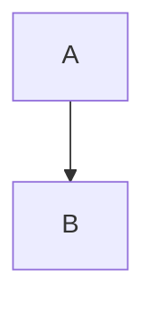

# 渲染器Bug修复指南

> **文档目的**：记录VCPChat渲染器系统的Bug修复经验和最佳实践，为后续渲染器的开发和维护提供参考。

## 📑 目录

- [1. MermaidRenderer 修复经验](#1-mermaidrenderer-修复经验)
  - [1.1 问题1：Mermaid图表渲染失败（DOM时序问题）](#11-问题1mermaid图表渲染失败dom时序问题)
  - [1.2 问题2：全屏按钮不起作用](#12-问题2全屏按钮不起作用)
  - [1.3 问题3：混合内容渲染问题](#13-问题3混合内容渲染问题)
- [2. HtmlRenderer 修复经验](#2-htmlrenderer-修复经验)
  - [2.1 修复的5个问题总结](#21-修复的5个问题总结)
  - [2.2 CSS规则冲突的解决方案](#22-css规则冲突的解决方案)
  - [2.3 事件绑定架构的最佳实践](#23-事件绑定架构的最佳实践)
- [3. 通用最佳实践](#3-通用最佳实践)
  - [3.1 渲染器生命周期管理](#31-渲染器生命周期管理)
  - [3.2 事件绑定的正确时机](#32-事件绑定的正确时机)
  - [3.3 CSS样式的优先级管理](#33-css样式的优先级管理)
  - [3.4 主题适配（Light/Dark模式）](#34-主题适配lightdark模式)
  - [3.5 混合内容检测的通用模式](#35-混合内容检测的通用模式)
- [4. 常见陷阱和注意事项](#4-常见陷阱和注意事项)
  - [4.1 DOM时序问题](#41-dom时序问题)
  - [4.2 CSS加载顺序](#42-css加载顺序)
  - [4.3 流式渲染 vs 静态渲染](#43-流式渲染-vs-静态渲染)
  - [4.4 防御性编程检查点](#44-防御性编程检查点)

---

## 1. MermaidRenderer 修复经验

### 1.1 问题1：Mermaid图表渲染失败（DOM时序问题）

#### 🔍 问题描述

当AI回复包含Mermaid代码块时，图表无法渲染成SVG，只显示加载占位符或空白区域。

#### 🎯 根本原因

在 `ui.ts` 的 `onStreamEnd` 回调中，`renderMessage()` 在元素插入到DOM之前就调用了 `finalize()`。Mermaid.js 需要元素已经在DOM中才能正确计算尺寸（调用 `getBoundingClientRect()`）。

**问题代码**（修复前）：

```typescript
// ❌ 错误：finalize() 在元素插入DOM之前被调用
const renderResult = await messageRenderer.renderMessage(finalMessage, {
  streaming: false,
  enableThemeColor: true
  // finalize() 在这里被调用，但元素还没有插入到DOM中
});

// 元素插入到DOM
assistantMessageEl.parentElement.replaceChild(newMessageEl, assistantMessageEl);
```

#### ✅ 解决方案：`skipFinalize` 模式

**步骤1**：在 `MessageRenderOptions` 中添加 `skipFinalize` 选项

```typescript
// src/core/renderer/messageRenderer.ts
export interface MessageRenderOptions {
  // ... 其他选项
  
  /**
   * Skip finalize step (useful when element is not yet in DOM)
   * Default: false
   */
  skipFinalize?: boolean;
}
```

**步骤2**：修改 `renderStatic()` 方法支持 `skipFinalize`

```typescript
// src/core/renderer/messageRenderer.ts
private async renderStatic(
  message: Message,
  options: MessageRenderOptions,
  skipFinalize: boolean = false  // 新增参数
): Promise<MessageRenderResult> {
  // ... 渲染逻辑
  
  // 🔑 关键：只有在 skipFinalize=false 时才调用 finalize()
  if (!skipFinalize && renderer.finalize) {
    await renderer.finalize(refs.contentZone);
  }
  
  return { refs, renderer };
}
```

**步骤3**：在 `ui.ts` 中使用 `skipFinalize` 模式

```typescript
// src/core/ui.ts
onStreamEnd: async (finalMessage: Message) => {
  // ✅ 正确：使用 skipFinalize: true
  const renderResult = await messageRenderer.renderMessage(finalMessage, {
    streaming: false,
    enableThemeColor: true,
    skipFinalize: true  // 🔑 跳过finalize
  });

  // 元素插入到DOM
  if (assistantMessageEl.parentElement) {
    assistantMessageEl.parentElement.replaceChild(newMessageEl, assistantMessageEl);
    
    // 🔑 关键：在元素插入到DOM之后，手动调用finalize
    if (renderResult.renderer && renderResult.renderer.finalize) {
      await renderResult.renderer.finalize(renderResult.refs.contentZone);
    }
  }
}
```

**步骤4**：修改 `MermaidRenderer.finalize()` 支持非流式渲染

```typescript
// src/core/renderer/renderers/mermaidRenderer.ts
public async finalize(container: HTMLElement): Promise<void> {
  try {
    // 🔑 修复：处理流式渲染模式
    if (this.streamBuffer) {
      // 流式渲染：渲染缓冲的内容
      const loading = container.querySelector('.mermaid-loading');
      if (loading) loading.remove();
      
      const html = await this.render(this.streamBuffer);
      container.innerHTML = html;
      this.streamBuffer = '';
    }

    // 🔑 修复：无论是流式还是非流式渲染，都初始化Mermaid图表
    await this.initializeMermaid(container);
    
    // 绑定全屏按钮
    this.setupFullscreenButton(container);
  } catch (error) {
    console.error('[MermaidRenderer] Finalize error:', error);
  }
}
```

#### 🧪 测试验证

**验证步骤**：
1. 向AI发送消息："请生成一个简单的Mermaid流程图"
2. 检查控制台日志，确认执行顺序：
   - `[UI] Calling renderMessage() with streaming=false`
   - `[UI] DOM element replaced successfully`
   - `[UI] Calling finalize() after DOM insertion`
   - `[MermaidRenderer] Diagram rendered successfully`
3. 检查页面，确认Mermaid图表成功渲染成SVG

**成功标志**：
- ✅ Mermaid图表显示为SVG图形（不是加载占位符）
- ✅ 控制台日志显示 `finalize()` 在DOM插入之后被调用
- ✅ 没有 `getBoundingClientRect()` 相关的错误

---

### 1.2 问题2：全屏按钮不起作用

#### 🔍 问题描述

点击Mermaid图表右上角的全屏按钮后，没有任何反应，无法进入全屏模式。

#### 🎯 根本原因

`MermaidRenderer` 在 `buildDiagramHtml()` 方法中渲染了全屏按钮的HTML，但是**没有绑定点击事件监听器**。

**问题代码**（修复前）：

```typescript
// ❌ 错误：只渲染了HTML，没有绑定事件
private buildDiagramHtml(diagramId: string): string {
  return `
    <div class="mermaid-renderer">
      <div class="mermaid-header">
        <button class="mermaid-fullscreen-btn">Fullscreen</button>
      </div>
      <!-- ... -->
    </div>
  `;
}

public async finalize(container: HTMLElement): Promise<void> {
  // ❌ 错误：没有调用事件绑定方法
  await this.initializeMermaid(container);
  // 缺少：this.setupFullscreenButton(container);
}
```

#### ✅ 解决方案：创建事件绑定方法

**步骤1**：创建 `setupFullscreenButton()` 方法

```typescript
// src/core/renderer/renderers/mermaidRenderer.ts
/**
 * Setup fullscreen button click event
 * 🔑 关键：必须在元素插入到DOM之后调用
 */
private setupFullscreenButton(container: HTMLElement): void {
  // 🔑 修复：container可能是.message-content-zone，需要找到.mermaid-renderer
  const mermaidRenderer = container.classList.contains('mermaid-renderer')
    ? container
    : container.querySelector('.mermaid-renderer') as HTMLElement;

  if (!mermaidRenderer) {
    console.error('[MermaidRenderer] Cannot find .mermaid-renderer element');
    return;
  }

  const fullscreenBtn = mermaidRenderer.querySelector('.mermaid-fullscreen-btn');

  if (fullscreenBtn) {
    // 🔑 关键：绑定点击事件
    fullscreenBtn.addEventListener('click', () => {
      this.toggleFullScreen(mermaidRenderer);
    });

    console.log('[MermaidRenderer] Fullscreen button event bound');
  }
}
```

**步骤2**：创建 `toggleFullScreen()` 方法

```typescript
// src/core/renderer/renderers/mermaidRenderer.ts
/**
 * Toggle fullscreen mode
 */
private toggleFullScreen(container: HTMLElement): void {
  const fullscreenBtn = container.querySelector('.mermaid-fullscreen-btn');
  const iconImg = fullscreenBtn?.querySelector('.fullscreen-icon') as HTMLImageElement;
  const theme = this.getCurrentTheme();
  const iconFilter = theme === 'light' ? 'filter: invert(1);' : '';

  if (container.classList.contains('fullscreen')) {
    // 退出全屏
    container.classList.remove('fullscreen');

    if (iconImg) {
      iconImg.src = 'src/template/pic_resource/icon/Emoji_instead/24-1px-whole-screen.svg';
      iconImg.alt = 'Fullscreen';
      iconImg.style.cssText = `width: 16px; height: 16px; ${iconFilter}`;
    }
    if (fullscreenBtn) {
      fullscreenBtn.setAttribute('title', 'Toggle Full Screen');
    }
  } else {
    // 进入全屏
    container.classList.add('fullscreen');

    if (iconImg) {
      iconImg.src = 'src/template/pic_resource/icon/Emoji_instead/small-screen.svg';
      iconImg.alt = 'Exit Fullscreen';
      iconImg.style.cssText = `width: 16px; height: 16px; ${iconFilter}`;
    }
    if (fullscreenBtn) {
      fullscreenBtn.setAttribute('title', 'Exit Full Screen');
    }
  }
}
```

**步骤3**：在 `finalize()` 中调用事件绑定方法

```typescript
// src/core/renderer/renderers/mermaidRenderer.ts
public async finalize(container: HTMLElement): Promise<void> {
  try {
    // ... 渲染逻辑

    await this.initializeMermaid(container);

    // 🔑 关键：绑定全屏按钮的点击事件
    this.setupFullscreenButton(container);
  } catch (error) {
    console.error('[MermaidRenderer] Finalize error:', error);
  }
}
```

**步骤4**：添加全屏模式的CSS样式

```css
/* src/styles/mermaid-renderer.css */

/* 全屏图标样式 */
.fullscreen-icon {
  width: 16px;
  height: 16px;
  /* Light模式下反转浅色SVG图标为深色 */
  filter: invert(1);
}

/* Dark模式下保持浅色SVG图标不变 */
[data-theme="dark"] .fullscreen-icon {
  filter: none;
}

/* 全屏模式样式 */
.mermaid-renderer.fullscreen {
  position: fixed;
  top: 0;
  left: 0;
  right: 0;
  bottom: 0;
  z-index: 9999;
  border-radius: 0;
  max-width: none;
  min-height: 100vh;
  background: var(--bg-primary);
}

.mermaid-renderer.fullscreen .mermaid-diagram-container {
  min-height: calc(100vh - 60px);
  max-height: calc(100vh - 60px);
}
```

#### 🧪 测试验证

**验证步骤**：
1. 向AI发送消息："请生成一个简单的Mermaid流程图"
2. 等待图表渲染完成
3. 点击图表右上角的全屏按钮
4. 检查页面状态：
   - 容器是否添加了 `.fullscreen` 类
   - CSS样式是否正确应用（`position: fixed`, `z-index: 9999`）
   - 按钮文字是否变为 "Exit Fullscreen"
   - 图标是否切换为 `small-screen.svg`
5. 再次点击按钮，检查是否退出全屏

**成功标志**：
- ✅ 点击按钮后，图表进入全屏模式
- ✅ 容器添加了 `.fullscreen` 类
- ✅ 按钮文字和图标正确切换
- ✅ 再次点击后，退出全屏模式

---

### 1.3 问题3：混合内容渲染问题

#### 🔍 问题描述

当AI回复包含普通文字和Mermaid代码块时，只显示Mermaid图表，普通文字丢失。

**示例**：
```
下面是一个简单的流程图示例：



这个流程图展示了...
```

**实际显示**：只显示Mermaid图表，"下面是一个简单的流程图示例："和"这个流程图展示了..."都不显示。

#### 🎯 根本原因

**原因1**：`ContentProcessor.detectContentType()` 在检测到Mermaid代码块时，没有检查是否覆盖整个内容，导致整个消息被识别为 `mermaid` 类型。

**原因2**：`MarkdownRenderer.applySyntaxHighlighting()` 没有处理Mermaid代码块，导致Mermaid代码块被渲染成普通的 `<pre><code class="language-mermaid">` 而不是 `.mermaid-renderer` 容器。

**问题代码**（修复前）：

```typescript
// ❌ 错误：没有检查Mermaid代码块是否覆盖整个内容
// src/core/renderer/contentProcessor.ts
const mermaidMatch = this.patterns.mermaidBlock.exec(trimmed);
if (mermaidMatch) {
  return {
    type: 'mermaid',
    confidence: 1.0,
    metadata: {},
    rawContent: mermaidMatch[1]  // ❌ 只包含Mermaid代码，丢失其他文字
  };
}
```

```typescript
// ❌ 错误：没有处理Mermaid代码块
// src/core/renderer/renderers/markdownRenderer.ts
if (language.toLowerCase() === 'html') {
  // 使用CodeRenderer处理HTML代码块
} else {
  // ❌ 其他语言（包括Mermaid）都使用基本语法高亮
  const highlighted = this.applyBasicHighlighting(code, language);
  codeBlock.innerHTML = highlighted;
}
```

#### ✅ 解决方案：`isEntireContent` 检查模式

**步骤1**：修改 `ContentProcessor.detectContentType()` 的Mermaid检测逻辑

参考HTML检测逻辑，添加"是否覆盖整个内容"的检查：

```typescript
// src/core/renderer/contentProcessor.ts
// Priority 1: Mermaid diagrams
// 🔑 修复：参考HTML检测逻辑，检查Mermaid代码块是否覆盖整个内容
this.patterns.mermaidBlock.lastIndex = 0;
const mermaidMatch = this.patterns.mermaidBlock.exec(trimmed);
if (mermaidMatch) {
  // 🔑 关键：检查Mermaid代码块是否覆盖整个内容
  const matchStart = mermaidMatch.index;
  const matchEnd = matchStart + mermaidMatch[0].length;
  const isEntireContent = (matchStart === 0 && matchEnd === trimmed.length);

  if (isEntireContent) {
    // 整个内容都是Mermaid代码块，使用MermaidRenderer
    return {
      type: 'mermaid',
      confidence: 1.0,
      metadata: {},
      rawContent: mermaidMatch[1]
    };
  } else {
    // 🔑 关键：包含其他内容（如说明文字），使用MarkdownRenderer
    // MarkdownRenderer会调用MermaidRenderer来渲染Mermaid部分
    return {
      type: 'markdown',
      confidence: 0.95,
      metadata: {},
      rawContent: trimmed  // 🔑 保留完整内容
    };
  }
}
```

**参考：HTML检测逻辑**（已经正确实现）：

```typescript
// src/core/renderer/contentProcessor.ts
// Priority 6: HTML
if (this.patterns.htmlTag.test(trimmed)) {
  const tagCount = (trimmed.match(this.patterns.htmlTag) || []).length;
  const confidence = Math.min(tagCount / 5, 1.0);

  // 🔑 修复：检查是否包含Markdown代码块标记
  const hasMarkdownCodeBlock = /```/.test(trimmed);

  if (sender === 'agent') {
    // 🔑 关键：如果包含Markdown代码块标记，直接返回Markdown类型
    if (hasMarkdownCodeBlock) {
      return {
        type: 'markdown',
        confidence: 0.95,
        metadata: {},
        rawContent: trimmed
      };
    }
    // ... else return 'code' type
  }
}
```

**步骤2**：在 `MarkdownRenderer.applySyntaxHighlighting()` 中处理Mermaid代码块

```typescript
// src/core/renderer/renderers/markdownRenderer.ts
private async applySyntaxHighlighting(html: string): Promise<string> {
  const parser = new DOMParser();
  const doc = parser.parseFromString(html, 'text/html');
  const codeBlocks = doc.querySelectorAll('pre code');

  const promises = Array.from(codeBlocks).map(async (codeBlock) => {
    const code = codeBlock.textContent || '';
    const languageClass = Array.from(codeBlock.classList)
      .find(cls => cls.startsWith('language-'));

    if (languageClass) {
      const language = languageClass.replace('language-', '');
      codeBlock.setAttribute('data-language', language);

      if (language.toLowerCase() === 'html') {
        // 使用CodeRenderer处理HTML代码块
        // ... (已有代码)
      } else if (language.toLowerCase() === 'mermaid') {
        // 🔑 修复：如果是Mermaid代码块，使用MermaidRenderer
        try {
          const { MermaidRenderer } = await import('./mermaidRenderer');
          const mermaidRenderer = new MermaidRenderer();

          // 使用MermaidRenderer渲染
          const renderedHtml = await mermaidRenderer.render(code);

          // 替换整个<pre>元素
          const preElement = codeBlock.parentElement;
          if (preElement && preElement.tagName === 'PRE') {
            const tempDiv = doc.createElement('div');
            tempDiv.innerHTML = renderedHtml;

            if (tempDiv.firstElementChild) {
              preElement.replaceWith(tempDiv.firstElementChild);
            }
          }
        } catch (error) {
          console.error('[MarkdownRenderer] Failed to use MermaidRenderer:', error);
          // 降级到基本语法高亮
          const highlighted = this.applyBasicHighlighting(code, language);
          codeBlock.innerHTML = highlighted;
        }
      } else {
        // 其他语言：使用基本语法高亮
        const highlighted = this.applyBasicHighlighting(code, language);
        codeBlock.innerHTML = highlighted;
      }
    }
  });

  await Promise.all(promises);
  return doc.body.innerHTML;
}
```

**步骤3**：在 `MarkdownRenderer.finalize()` 中绑定全屏按钮

```typescript
// src/core/renderer/renderers/markdownRenderer.ts
public async finalize(container: HTMLElement): Promise<void> {
  try {
    // ... 其他逻辑

    // 🔑 修复：查找并初始化Mermaid渲染器
    const mermaidRenderers = container.querySelectorAll('.mermaid-renderer');

    if (mermaidRenderers.length > 0) {
      const { MermaidRenderer } = await import('./mermaidRenderer');
      const mermaidRenderer = new MermaidRenderer();

      for (const mermaidContainer of Array.from(mermaidRenderers)) {
        try {
          // 初始化Mermaid图表
          await mermaidRenderer.initializeMermaid(mermaidContainer as HTMLElement);

          // 🔑 关键：绑定全屏按钮的点击事件
          mermaidRenderer.setupFullscreenButton(mermaidContainer as HTMLElement);
        } catch (error) {
          console.error('[MarkdownRenderer] Failed to initialize mermaid diagram:', error);
        }
      }
    }
  } catch (error) {
    console.error('[MarkdownRenderer] Finalize error:', error);
  }
}
```

#### 🧪 测试验证

**测试场景1**：AI回复只包含Mermaid代码块

```

```

**预期结果**：
- ✅ 检测类型：`mermaid`
- ✅ 使用 `MermaidRenderer` 渲染
- ✅ 显示Mermaid图表

**测试场景2**：AI回复包含说明文字 + Mermaid代码块

```
下面是一个简单的流程图示例：


这个流程图展示了...
```

**预期结果**：
- ✅ 检测类型：`markdown`
- ✅ 使用 `MarkdownRenderer` 渲染
- ✅ 显示说明文字 + Mermaid图表
- ✅ 全屏按钮功能正常

**成功标志**：
- ✅ 普通文字和Mermaid图表都正确显示
- ✅ Mermaid图表成功渲染成SVG
- ✅ 全屏按钮功能正常

---

## 2. HtmlRenderer 修复经验

### 2.1 修复的5个问题总结

#### 问题1：Render按钮在Light主题下不可见

**根本原因**：白色SVG图标在浅色背景上对比度太低。

**解决方案**：
```css
/* Light模式下反转图标颜色 */
.render-icon {
  filter: invert(1);
}

/* Dark模式下保持原色 */
[data-theme="dark"] .render-icon {
  filter: none;
}
```

#### 问题2：Code按钮使用emoji而不是SVG图标

**根本原因**：HTML模板中使用了emoji字符。

**解决方案**：替换为SVG图标并应用相同的颜色反转逻辑。

#### 问题3：预览中出现重复的"HTML Content"标题

**根本原因**：`HtmlRenderer.buildPreviewHtml()` 和 `CodeRenderer.render()` 都添加了标题。

**解决方案**：在 `HtmlRenderer` 中移除重复的标题。

#### 问题4：Fullscreen按钮使用emoji而不是SVG图标

**根本原因**：HTML模板中使用了emoji字符。

**解决方案**：替换为SVG图标并应用相同的颜色反转逻辑。

#### 问题5：Fullscreen按钮不起作用

**根本原因**：HTML渲染但未绑定事件。

**解决方案**：创建 `setupIframe()` 方法来绑定全屏按钮的点击事件。

---

### 2.2 CSS规则冲突的解决方案

#### 🔍 问题描述

`code-renderer.css` 中的图标颜色反转规则被 `syntax-highlighter.css` 覆盖，导致Light模式下图标不可见。

#### 🎯 根本原因

CSS文件的加载顺序导致 `syntax-highlighter.css` 的规则覆盖了 `code-renderer.css` 的规则。

**问题代码**（修复前）：

```css
/* code-renderer.css - 先加载 */
.render-icon {
  filter: invert(1);
}

/* syntax-highlighter.css - 后加载，覆盖了上面的规则 */
.render-icon {
  filter: none;  /* ❌ 覆盖了code-renderer.css的规则 */
}
```

#### ✅ 解决方案

**方案1**：提高CSS选择器的优先级

```css
/* code-renderer.css */
/* 🔑 使用更具体的选择器提高优先级 */
.code-renderer .render-icon {
  filter: invert(1);
}

[data-theme="dark"] .code-renderer .render-icon {
  filter: none;
}
```

**方案2**：调整CSS文件的加载顺序

确保 `code-renderer.css` 在 `syntax-highlighter.css` 之后加载。

**方案3**：使用 `!important`（不推荐，仅作为最后手段）

```css
/* code-renderer.css */
.render-icon {
  filter: invert(1) !important;
}
```

**推荐方案**：方案1（提高选择器优先级），因为它不依赖加载顺序，也不使用 `!important`。

---

### 2.3 事件绑定架构的最佳实践

#### 🔍 问题描述

`MarkdownRenderer.finalize()` 有一个防御性检查，阻止了静态渲染模式下的事件绑定。

**问题代码**（修复前）：

```typescript
// ❌ 错误：防御性检查阻止了静态渲染模式下的事件绑定
public async finalize(container: HTMLElement): Promise<void> {
  if (!this.streamBuffer) {
    return;  // ❌ 静态渲染模式下直接返回，不绑定事件
  }

  // 绑定事件...
}
```

#### ✅ 解决方案：分离渲染逻辑和事件绑定逻辑

**步骤1**：将事件绑定方法设为 `public`

```typescript
// src/core/renderer/renderers/codeRenderer.ts
/**
 * Setup interactive features (copy, render buttons)
 * 🔑 关键：设为public，允许外部调用
 */
public setupInteractiveFeatures(container: HTMLElement): void {
  this.setupCopyButton(container);
  this.setupRenderButton(container);
}
```

**步骤2**：修改 `finalize()` 方法

```typescript
// src/core/renderer/renderers/markdownRenderer.ts
public async finalize(container: HTMLElement): Promise<void> {
  try {
    // 🔑 修复：如果有 streamBuffer，先渲染完整内容
    if (this.streamBuffer) {
      const html = await this.render(this.streamBuffer);
      container.innerHTML = html;
      this.streamBuffer = '';
    }

    // 🔑 修复：无论是流式还是静态渲染，都查找并绑定事件
    const codeRenderers = container.querySelectorAll('.code-renderer');
    if (codeRenderers.length > 0) {
      const { CodeRenderer } = await import('./codeRenderer');
      const codeRenderer = new CodeRenderer();

      for (const codeContainer of Array.from(codeRenderers)) {
        codeRenderer.setupInteractiveFeatures(codeContainer as HTMLElement);
      }
    }
  } catch (error) {
    console.error('[MarkdownRenderer] Finalize error:', error);
  }
}
```

**关键原则**：
1. **分离关注点**：渲染逻辑和事件绑定逻辑应该分离
2. **公开事件绑定方法**：允许外部调用，提高灵活性
3. **无论渲染模式如何，都绑定事件**：流式渲染和静态渲染都需要事件绑定

---

## 3. 通用最佳实践

### 3.1 渲染器生命周期管理

#### 📋 标准生命周期

```
1. 内容检测 (ContentProcessor.detectContentType)
   ↓
2. 渲染器选择 (MessageRenderer.renderMessage)
   ↓
3. HTML生成 (Renderer.render)
   ↓
4. DOM插入 (ui.ts)
   ↓
5. 初始化和事件绑定 (Renderer.finalize)
```

#### 🔑 关键原则

**原则1**：`finalize()` 必须在元素插入到DOM之后调用

```typescript
// ✅ 正确
const renderResult = await messageRenderer.renderMessage(message, {
  skipFinalize: true  // 跳过finalize
});

// 插入到DOM
container.appendChild(renderResult.refs.container);

// 在DOM插入之后调用finalize
await renderResult.renderer.finalize(renderResult.refs.contentZone);
```

```typescript
// ❌ 错误
const renderResult = await messageRenderer.renderMessage(message, {
  skipFinalize: false  // finalize在DOM插入之前被调用
});

// 插入到DOM（太晚了）
container.appendChild(renderResult.refs.container);
```

**原则2**：`finalize()` 应该支持流式和静态两种渲染模式

```typescript
public async finalize(container: HTMLElement): Promise<void> {
  // 处理流式渲染模式
  if (this.streamBuffer) {
    const html = await this.render(this.streamBuffer);
    container.innerHTML = html;
    this.streamBuffer = '';
  }

  // 🔑 关键：无论哪种模式，都执行初始化和事件绑定
  await this.initialize(container);
  this.setupEvents(container);
}
```

**原则3**：事件绑定方法应该是 `public` 的

```typescript
// ✅ 正确：允许外部调用
public setupInteractiveFeatures(container: HTMLElement): void {
  this.setupCopyButton(container);
  this.setupRenderButton(container);
}

// ❌ 错误：外部无法调用
private setupInteractiveFeatures(container: HTMLElement): void {
  // ...
}
```

---

### 3.2 事件绑定的正确时机

#### 🔑 关键原则

**原则1**：事件绑定必须在元素插入到DOM之后

```typescript
// ✅ 正确
container.appendChild(element);  // 先插入DOM
element.addEventListener('click', handler);  // 再绑定事件

// ❌ 错误（虽然通常也能工作，但不是最佳实践）
element.addEventListener('click', handler);  // 先绑定事件
container.appendChild(element);  // 再插入DOM
```

**原则2**：使用事件委托处理动态内容

```typescript
// ✅ 正确：使用事件委托
container.addEventListener('click', (e) => {
  const target = e.target as HTMLElement;
  if (target.classList.contains('copy-btn')) {
    this.handleCopy(target);
  }
});

// ❌ 错误：为每个按钮单独绑定事件（动态内容会丢失事件）
const buttons = container.querySelectorAll('.copy-btn');
buttons.forEach(btn => {
  btn.addEventListener('click', this.handleCopy);
});
```

**原则3**：避免重复绑定事件

```typescript
// ✅ 正确：检查是否已经绑定
private setupCopyButton(container: HTMLElement): void {
  const copyBtn = container.querySelector('.copy-btn');

  if (copyBtn && !copyBtn.hasAttribute('data-event-bound')) {
    copyBtn.addEventListener('click', this.handleCopy);
    copyBtn.setAttribute('data-event-bound', 'true');
  }
}

// ❌ 错误：可能重复绑定
private setupCopyButton(container: HTMLElement): void {
  const copyBtn = container.querySelector('.copy-btn');
  copyBtn?.addEventListener('click', this.handleCopy);  // 可能重复绑定
}
```

---

### 3.3 CSS样式的优先级管理

#### 🔑 CSS优先级规则

1. **内联样式** > **ID选择器** > **类选择器** > **标签选择器**
2. **后加载的CSS** 覆盖 **先加载的CSS**（相同优先级时）
3. **更具体的选择器** 优先级更高

#### ✅ 最佳实践

**实践1**：使用具体的选择器避免冲突

```css
/* ✅ 正确：使用具体的选择器 */
.code-renderer .render-icon {
  filter: invert(1);
}

/* ❌ 错误：选择器太宽泛，容易被覆盖 */
.render-icon {
  filter: invert(1);
}
```

**实践2**：使用CSS变量提高可维护性

```css
/* ✅ 正确：使用CSS变量 */
:root {
  --icon-filter-light: invert(1);
  --icon-filter-dark: none;
}

[data-theme="light"] .render-icon {
  filter: var(--icon-filter-light);
}

[data-theme="dark"] .render-icon {
  filter: var(--icon-filter-dark);
}
```

**实践3**：避免使用 `!important`

```css
/* ❌ 错误：滥用 !important */
.render-icon {
  filter: invert(1) !important;
}

/* ✅ 正确：提高选择器优先级 */
.code-renderer .render-icon {
  filter: invert(1);
}
```

**实践4**：组织CSS文件的加载顺序

```html
<!-- ✅ 正确：基础样式 → 组件样式 → 主题样式 -->
<link rel="stylesheet" href="base.css">
<link rel="stylesheet" href="code-renderer.css">
<link rel="stylesheet" href="theme.css">

<!-- ❌ 错误：顺序混乱 -->
<link rel="stylesheet" href="theme.css">
<link rel="stylesheet" href="code-renderer.css">
<link rel="stylesheet" href="base.css">
```

---

### 3.4 主题适配（Light/Dark模式）

#### 🔑 标准模式

**模式1**：使用 `data-theme` 属性

```css
/* Light模式 */
[data-theme="light"] .icon {
  filter: invert(1);  /* 白色图标 → 黑色图标 */
}

/* Dark模式 */
[data-theme="dark"] .icon {
  filter: none;  /* 保持白色图标 */
}
```

**模式2**：使用CSS变量

```css
/* 定义主题变量 */
[data-theme="light"] {
  --icon-color: #000000;
  --bg-color: #ffffff;
  --text-color: #333333;
}

[data-theme="dark"] {
  --icon-color: #ffffff;
  --bg-color: #1e1e1e;
  --text-color: #e0e0e0;
}

/* 使用主题变量 */
.icon {
  color: var(--icon-color);
}

.container {
  background: var(--bg-color);
  color: var(--text-color);
}
```

#### ✅ 最佳实践

**实践1**：SVG图标的颜色反转

```css
/* Light模式：反转白色SVG图标为黑色 */
[data-theme="light"] .icon {
  filter: invert(1);
}

/* Dark模式：保持白色SVG图标 */
[data-theme="dark"] .icon {
  filter: none;
}
```

**实践2**：动态检测当前主题

```typescript
/**
 * Get current theme (light or dark)
 */
private getCurrentTheme(): 'light' | 'dark' {
  const themeAttr = document.documentElement.getAttribute('data-theme');
  return themeAttr === 'dark' ? 'dark' : 'light';
}

/**
 * Apply theme-specific styles
 */
private applyThemeStyles(element: HTMLElement): void {
  const theme = this.getCurrentTheme();
  const iconFilter = theme === 'light' ? 'filter: invert(1);' : '';

  const icon = element.querySelector('.icon') as HTMLImageElement;
  if (icon) {
    icon.style.cssText = `width: 16px; height: 16px; ${iconFilter}`;
  }
}
```

**实践3**：监听主题变化

```typescript
/**
 * Listen for theme changes
 */
private setupThemeListener(): void {
  const observer = new MutationObserver((mutations) => {
    mutations.forEach((mutation) => {
      if (mutation.attributeName === 'data-theme') {
        this.onThemeChange();
      }
    });
  });

  observer.observe(document.documentElement, {
    attributes: true,
    attributeFilter: ['data-theme']
  });
}

private onThemeChange(): void {
  // 更新所有图标的样式
  const icons = document.querySelectorAll('.icon');
  icons.forEach(icon => {
    this.applyThemeStyles(icon.parentElement as HTMLElement);
  });
}
```

---

### 3.5 混合内容检测的通用模式

#### 🔑 检测模式

**模式1**：`isEntireContent` 检查（推荐）

```typescript
// 检查特殊内容是否覆盖整个消息
const match = pattern.exec(trimmed);
if (match) {
  const matchStart = match.index;
  const matchEnd = matchStart + match[0].length;
  const isEntireContent = (matchStart === 0 && matchEnd === trimmed.length);

  if (isEntireContent) {
    // 使用专用渲染器
    return { type: 'special', rawContent: match[1] };
  } else {
    // 使用MarkdownRenderer（会调用专用渲染器处理嵌入内容）
    return { type: 'markdown', rawContent: trimmed };
  }
}
```

**模式2**：检查Markdown代码块标记

```typescript
// 检查是否包含Markdown代码块标记
const hasMarkdownCodeBlock = /```/.test(trimmed);

if (hasSpecialContent && hasMarkdownCodeBlock) {
  // 包含混合内容，使用MarkdownRenderer
  return { type: 'markdown', rawContent: trimmed };
}
```

#### ✅ 应用示例

**示例1**：Mermaid检测

```typescript
// src/core/renderer/contentProcessor.ts
const mermaidMatch = this.patterns.mermaidBlock.exec(trimmed);
if (mermaidMatch) {
  const matchStart = mermaidMatch.index;
  const matchEnd = matchStart + mermaidMatch[0].length;
  const isEntireContent = (matchStart === 0 && matchEnd === trimmed.length);

  if (isEntireContent) {
    return { type: 'mermaid', rawContent: mermaidMatch[1] };
  } else {
    return { type: 'markdown', rawContent: trimmed };
  }
}
```

**示例2**：HTML检测

```typescript
// src/core/renderer/contentProcessor.ts
if (this.patterns.htmlTag.test(trimmed)) {
  const hasMarkdownCodeBlock = /```/.test(trimmed);

  if (sender === 'agent') {
    if (hasMarkdownCodeBlock) {
      return { type: 'markdown', rawContent: trimmed };
    }
    return { type: 'code', rawContent: trimmed };
  }
}
```

**示例3**：在MarkdownRenderer中处理嵌入内容

```typescript
// src/core/renderer/renderers/markdownRenderer.ts
private async applySyntaxHighlighting(html: string): Promise<string> {
  const codeBlocks = doc.querySelectorAll('pre code');

  const promises = Array.from(codeBlocks).map(async (codeBlock) => {
    const language = this.getLanguage(codeBlock);

    if (language === 'html') {
      // 使用CodeRenderer处理HTML代码块
      return this.renderWithCodeRenderer(codeBlock);
    } else if (language === 'mermaid') {
      // 使用MermaidRenderer处理Mermaid代码块
      return this.renderWithMermaidRenderer(codeBlock);
    } else {
      // 使用基本语法高亮
      return this.applyBasicHighlighting(codeBlock);
    }
  });

  await Promise.all(promises);
  return doc.body.innerHTML;
}
```

---

## 4. 常见陷阱和注意事项

### 4.1 DOM时序问题

#### ⚠️ 陷阱1：在元素插入DOM之前调用需要DOM的API

**问题代码**：

```typescript
// ❌ 错误：元素还没有插入到DOM中
const element = document.createElement('div');
const rect = element.getBoundingClientRect();  // ❌ 返回全0
const width = element.offsetWidth;  // ❌ 返回0
```

**正确做法**：

```typescript
// ✅ 正确：先插入DOM，再调用API
const element = document.createElement('div');
container.appendChild(element);  // 先插入DOM
const rect = element.getBoundingClientRect();  // ✅ 返回正确的值
const width = element.offsetWidth;  // ✅ 返回正确的值
```

**识别方法**：
- 检查控制台是否有 `getBoundingClientRect()` 返回全0的警告
- 检查元素的 `offsetWidth`、`offsetHeight` 是否为0
- 检查Mermaid.js等库是否报告"无法计算尺寸"的错误

#### ⚠️ 陷阱2：在 `finalize()` 中过早返回

**问题代码**：

```typescript
// ❌ 错误：静态渲染模式下直接返回，不绑定事件
public async finalize(container: HTMLElement): Promise<void> {
  if (!this.streamBuffer) {
    return;  // ❌ 静态渲染模式下直接返回
  }

  // 绑定事件...（静态渲染模式下永远不会执行）
}
```

**正确做法**：

```typescript
// ✅ 正确：分离渲染逻辑和事件绑定逻辑
public async finalize(container: HTMLElement): Promise<void> {
  // 处理流式渲染模式
  if (this.streamBuffer) {
    const html = await this.render(this.streamBuffer);
    container.innerHTML = html;
    this.streamBuffer = '';
  }

  // 🔑 关键：无论哪种模式，都绑定事件
  this.setupEvents(container);
}
```

#### ⚠️ 陷阱3：忘记使用 `skipFinalize` 模式

**问题代码**：

```typescript
// ❌ 错误：finalize() 在元素插入DOM之前被调用
const renderResult = await messageRenderer.renderMessage(message, {
  streaming: false
  // finalize() 在这里被调用，但元素还没有插入到DOM中
});

container.appendChild(renderResult.refs.container);
```

**正确做法**：

```typescript
// ✅ 正确：使用 skipFinalize 模式
const renderResult = await messageRenderer.renderMessage(message, {
  streaming: false,
  skipFinalize: true  // 跳过finalize
});

container.appendChild(renderResult.refs.container);

// 在元素插入到DOM之后，手动调用finalize
await renderResult.renderer.finalize(renderResult.refs.contentZone);
```

---

### 4.2 CSS加载顺序

#### ⚠️ 陷阱1：CSS文件加载顺序导致样式被覆盖

**问题场景**：

```html
<!-- ❌ 错误：syntax-highlighter.css 后加载，覆盖了 code-renderer.css -->
<link rel="stylesheet" href="code-renderer.css">
<link rel="stylesheet" href="syntax-highlighter.css">
```

```css
/* code-renderer.css - 先加载 */
.render-icon {
  filter: invert(1);
}

/* syntax-highlighter.css - 后加载，覆盖了上面的规则 */
.render-icon {
  filter: none;  /* ❌ 覆盖了code-renderer.css的规则 */
}
```

**解决方案**：

**方案1**：调整加载顺序

```html
<!-- ✅ 正确：code-renderer.css 后加载 -->
<link rel="stylesheet" href="syntax-highlighter.css">
<link rel="stylesheet" href="code-renderer.css">
```

**方案2**：提高选择器优先级

```css
/* code-renderer.css */
/* ✅ 使用更具体的选择器 */
.code-renderer .render-icon {
  filter: invert(1);
}
```

**方案3**：使用 `!important`（不推荐）

```css
/* code-renderer.css */
.render-icon {
  filter: invert(1) !important;  /* ⚠️ 不推荐 */
}
```

#### ⚠️ 陷阱2：忘记为Dark模式添加样式

**问题代码**：

```css
/* ❌ 错误：只有Light模式的样式 */
.icon {
  filter: invert(1);
}
```

**正确做法**：

```css
/* ✅ 正确：同时定义Light和Dark模式的样式 */
[data-theme="light"] .icon {
  filter: invert(1);
}

[data-theme="dark"] .icon {
  filter: none;
}
```

---

### 4.3 流式渲染 vs 静态渲染

#### 🔑 关键区别

| 特性 | 流式渲染 | 静态渲染 |
|------|----------|----------|
| **触发时机** | AI回复过程中 | AI回复完成后 |
| **`streaming` 选项** | `true` | `false` |
| **`streamBuffer`** | 有内容 | 为空 |
| **`finalize()` 调用时机** | 流结束时 | 渲染完成后 |
| **DOM插入时机** | 渲染开始时 | 渲染完成后 |

#### ⚠️ 陷阱1：假设 `finalize()` 只在流式渲染时被调用

**问题代码**：

```typescript
// ❌ 错误：假设只有流式渲染才调用finalize()
public async finalize(container: HTMLElement): Promise<void> {
  if (!this.streamBuffer) {
    return;  // ❌ 静态渲染时直接返回
  }

  // 处理流式渲染...
}
```

**正确做法**：

```typescript
// ✅ 正确：支持两种渲染模式
public async finalize(container: HTMLElement): Promise<void> {
  // 处理流式渲染模式
  if (this.streamBuffer) {
    const html = await this.render(this.streamBuffer);
    container.innerHTML = html;
    this.streamBuffer = '';
  }

  // 🔑 关键：无论哪种模式，都执行初始化
  await this.initialize(container);
  this.setupEvents(container);
}
```

#### ⚠️ 陷阱2：在流式渲染时过早绑定事件

**问题代码**：

```typescript
// ❌ 错误：在流式渲染过程中绑定事件
public async renderStreaming(chunk: string): Promise<string> {
  this.streamBuffer += chunk;
  const html = await this.render(this.streamBuffer);

  // ❌ 错误：每次渲染都绑定事件，导致重复绑定
  this.setupEvents(container);

  return html;
}
```

**正确做法**：

```typescript
// ✅ 正确：只在finalize()中绑定事件
public async renderStreaming(chunk: string): Promise<string> {
  this.streamBuffer += chunk;
  return await this.render(this.streamBuffer);
}

public async finalize(container: HTMLElement): Promise<void> {
  // ... 渲染逻辑

  // ✅ 正确：只绑定一次事件
  this.setupEvents(container);
}
```

---

### 4.4 防御性编程检查点

#### ✅ 检查点1：验证DOM元素存在

```typescript
// ✅ 正确：检查元素是否存在
private setupCopyButton(container: HTMLElement): void {
  const copyBtn = container.querySelector('.copy-btn');

  if (!copyBtn) {
    console.warn('[Renderer] Copy button not found');
    return;
  }

  copyBtn.addEventListener('click', this.handleCopy);
}

// ❌ 错误：假设元素一定存在
private setupCopyButton(container: HTMLElement): void {
  const copyBtn = container.querySelector('.copy-btn');
  copyBtn.addEventListener('click', this.handleCopy);  // ❌ 可能抛出错误
}
```

#### ✅ 检查点2：验证容器类型

```typescript
// ✅ 正确：验证容器类型
private setupFullscreenButton(container: HTMLElement): void {
  // 🔑 关键：container可能是.message-content-zone，需要找到.mermaid-renderer
  const mermaidRenderer = container.classList.contains('mermaid-renderer')
    ? container
    : container.querySelector('.mermaid-renderer') as HTMLElement;

  if (!mermaidRenderer) {
    console.error('[MermaidRenderer] Cannot find .mermaid-renderer element');
    return;
  }

  // 继续处理...
}

// ❌ 错误：假设container就是目标元素
private setupFullscreenButton(container: HTMLElement): void {
  const fullscreenBtn = container.querySelector('.mermaid-fullscreen-btn');
  // ❌ 可能找不到按钮，因为container不是.mermaid-renderer
}
```

#### ✅ 检查点3：捕获异步错误

```typescript
// ✅ 正确：捕获异步错误
public async finalize(container: HTMLElement): Promise<void> {
  try {
    await this.initializeMermaid(container);
    this.setupFullscreenButton(container);
  } catch (error) {
    console.error('[MermaidRenderer] Finalize error:', error);
    // 显示错误提示或降级处理
  }
}

// ❌ 错误：不捕获错误
public async finalize(container: HTMLElement): Promise<void> {
  await this.initializeMermaid(container);  // ❌ 可能抛出错误
  this.setupFullscreenButton(container);
}
```

#### ✅ 检查点4：避免重复绑定事件

```typescript
// ✅ 正确：检查是否已经绑定
private setupCopyButton(container: HTMLElement): void {
  const copyBtn = container.querySelector('.copy-btn');

  if (copyBtn && !copyBtn.hasAttribute('data-event-bound')) {
    copyBtn.addEventListener('click', this.handleCopy);
    copyBtn.setAttribute('data-event-bound', 'true');
  }
}

// ❌ 错误：可能重复绑定
private setupCopyButton(container: HTMLElement): void {
  const copyBtn = container.querySelector('.copy-btn');
  copyBtn?.addEventListener('click', this.handleCopy);  // ❌ 可能重复绑定
}
```

#### ✅ 检查点5：验证第三方库是否加载

```typescript
// ✅ 正确：检查库是否加载
private async initializeMermaid(container: HTMLElement): Promise<void> {
  if (typeof window.mermaid === 'undefined') {
    console.error('[MermaidRenderer] Mermaid.js not loaded');
    return;
  }

  // 继续处理...
}

// ❌ 错误：假设库一定已加载
private async initializeMermaid(container: HTMLElement): Promise<void> {
  await window.mermaid.run({ nodes: [...] });  // ❌ 可能抛出错误
}
```

---

## 5. 总结

### 🎯 核心原则

1. **DOM时序**：`finalize()` 必须在元素插入到DOM之后调用
2. **事件绑定**：事件绑定方法应该是 `public` 的，支持外部调用
3. **渲染模式**：`finalize()` 应该支持流式和静态两种渲染模式
4. **混合内容**：使用 `isEntireContent` 检查模式处理混合内容
5. **CSS优先级**：使用具体的选择器避免样式冲突
6. **主题适配**：同时定义Light和Dark模式的样式
7. **防御性编程**：验证DOM元素存在，捕获异步错误

### 📚 参考资料

- **MermaidRenderer修复**：`src/core/renderer/renderers/mermaidRenderer.ts`
- **HtmlRenderer修复**：`src/core/renderer/renderers/htmlRenderer.ts`
- **MarkdownRenderer修复**：`src/core/renderer/renderers/markdownRenderer.ts`
- **ContentProcessor修复**：`src/core/renderer/contentProcessor.ts`
- **UI层修复**：`src/core/ui.ts`

### 🔧 快速检查清单

在修复或开发新的渲染器时，请检查以下项目：

- [ ] `finalize()` 是否在元素插入到DOM之后调用？
- [ ] `finalize()` 是否支持流式和静态两种渲染模式？
- [ ] 事件绑定方法是否是 `public` 的？
- [ ] 是否使用 `isEntireContent` 检查模式处理混合内容？
- [ ] CSS选择器是否足够具体，避免被覆盖？
- [ ] 是否同时定义了Light和Dark模式的样式？
- [ ] 是否验证了DOM元素存在？
- [ ] 是否捕获了异步错误？
- [ ] 是否避免了重复绑定事件？
- [ ] 是否验证了第三方库已加载？

---

**文档版本**：v1.0
**最后更新**：2025-01-13
**维护者**：VCPChat开发团队

